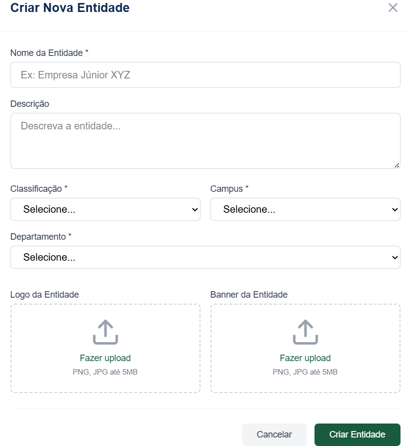

# RF-12: Permitir a criação de perfis institucionais de entidades, atribuindo o papel de gestor

## Descrição
O sistema deve permitir a criação de perfis institucionais de entidades por usuários autenticados (docentes ou discentes), atribuindo automaticamente ao criador o papel de gestor da página criada.

## Rastreabilidade
- **RNFs Relacionados:** 
[RNF03](../RNAOFuncionais/RNF_03.md) - Manter consistência visual
[RNF04](../RNAOFuncionais/RNF_04.md) - Feedback responsivo

Discutido na [fase 1 entrevista 2](../userDesign/Fase1/analiseEntrevista29-04.md)

## Regras de negócio
- [x] **RN1:** A criação do perfil da entidade só será considerada concluída quando o usuário preencher os campos obrigatórios corretamente, o banco de dados der um feedback, fazendo o usuário receber a mensagem de confirmação “Cadastro concluído com sucesso” na tela.
- [x] **RN2:** Se houver um problema em qualquer parte da criação de conta o usuário deve ser avisado como prosseguir.
- [x] **RN3:** O criador da entidade deve ser um membro com a classificação Gestor automaticamente

## Protótipo:

## Tela Final (Ao clicar no botão "Criar Projeto")

## DoR
- [x] O escopo e a regra de negócio estão claros e sem ambiguidades.
- [x] Protótipos aprovados pelos clientes.

## DoD
- [x] A entrega cumpre com as regras de negócio
- [x] A funcionalidade foi implementada de ponta a ponta (integração entre Next.js e NestJS, não existe entrega apenas de front e back isolados).
- [x] O código foi coberto e aprovado em testes automatizados (utilizando o Jest). Arquivos de teste: [1](https://github.com/mdsreq-fga-unb/REQ-2026.1-T02-ConectaUnB/blob/developer/apps/back/src/entidade/entidade.controller.spec.ts), [2](https://github.com/mdsreq-fga-unb/REQ-2026.1-T02-ConectaUnB/blob/developer/apps/back/src/entidade/entidade.service.spec.ts)
- [x] O código passou por revisões via Pull Requests no GitHub: [PR1](https://github.com/mdsreq-fga-unb/REQ-2026.1-T02-ConectaUnB/pull/100): Acrescenta rotas, [PR2](https://github.com/mdsreq-fga-unb/REQ-2026.1-T02-ConectaUnB/pull/154): Conecta rotas a interface