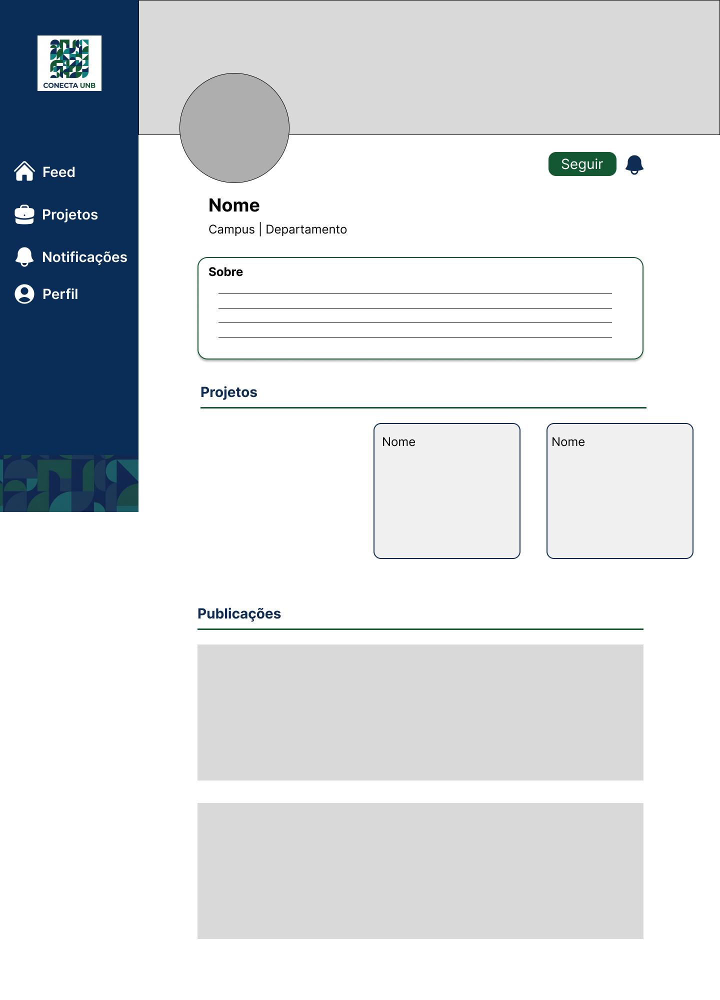
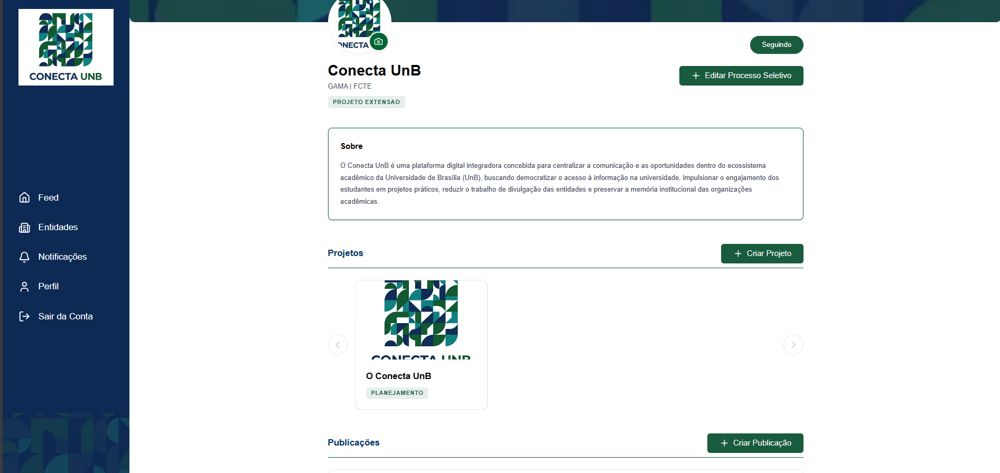

# RF-15: Permitir a visualização dos dados de um perfil de entidade

## Descrição
O sistema deve permitir a visualização dos dados de um perfil de entidade.

## Rastreabilidade

- **RNFs Relacionados:**

**[RNF-01](../RNAOFuncionais/RNF_01.md)** - Acessar plataforma sem login

Discutido na [fase 1 entrevista 2](../userDesign/Fase1/analiseEntrevista29-04.md)

## Regras de negócio
- [x] **RN1:** O acesso ao perfil da entidade só será considerado concluído quando o usuário for redirecionado para a visualização da entidade e conseguir visualizar corretamente as informações cadastradas, incluindo nome, nome de usuário, foto, publicações e número de seguidores.

## Protótipo:

## Tela Final

## DoR
- [x] O escopo e a regra de negócio estão claros e sem ambiguidades.
- [x] Protótipos aprovados pelos clientes.

## DoD
- [x] A entrega cumpre com as regras de negócio
- [x] A funcionalidade foi implementada de ponta a ponta (integração entre Next.js e NestJS, não existe entrega apenas de front e back isolados).
- [x] O código foi coberto e aprovado em testes automatizados (utilizando o Jest). Arquivos de teste: [1](https://github.com/mdsreq-fga-unb/REQ-2026.1-T02-ConectaUnB/blob/developer/apps/back/src/entidade/entidade.controller.spec.ts), [2](https://github.com/mdsreq-fga-unb/REQ-2026.1-T02-ConectaUnB/blob/developer/apps/back/src/entidade/entidade.service.spec.ts)
- [x] O código passou por revisões via Pull Requests no GitHub: [PR1](https://github.com/mdsreq-fga-unb/REQ-2026.1-T02-ConectaUnB/pull/100): Acrescenta rotas, [PR2](https://github.com/mdsreq-fga-unb/REQ-2026.1-T02-ConectaUnB/pull/154): Conecta rotas a interface
