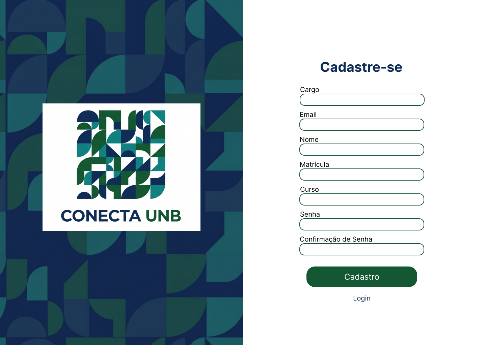
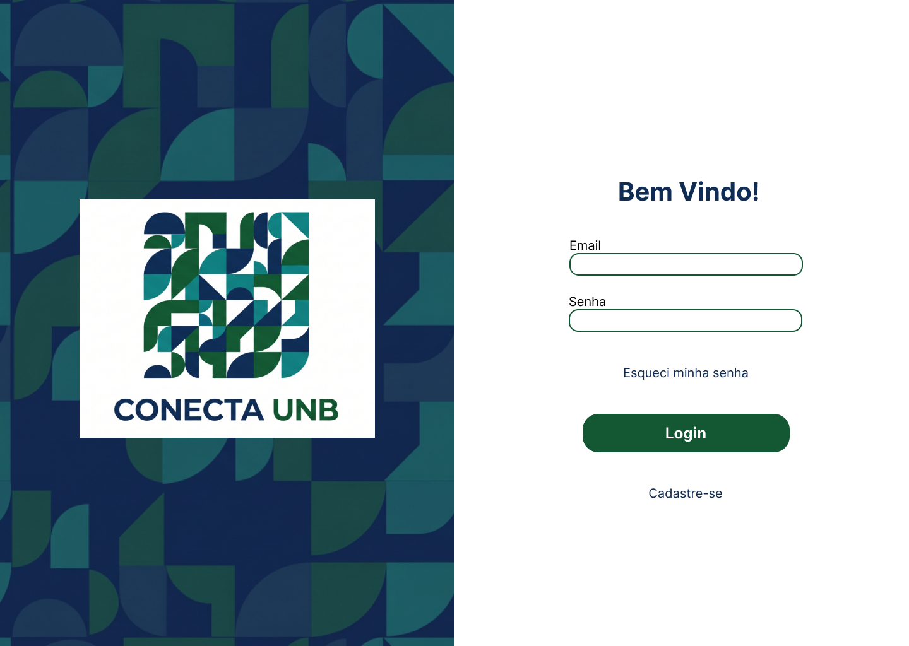

# RF-17: Permitir o cadastro de um perfil público de usuário.

## Descrição:
O sistema deve permitir o cadastro de um perfil público de usuário

## Rastreabilidade

- **RNFs Relacionados:**

**[RNF-04](../RNAOFuncionais/RNF_04.md)** - Feedback responsivo

**[RNF-07](../RNAOFuncionais/RNF_07.md)** - Coleta de métricas de acordo com LGPD

**[RNF-08](../RNAOFuncionais/RNF_08.md)** - Criptografar senhas dos usuários

Discutido na [fase 1 entrevista 2](../userDesign/Fase1/analiseEntrevista29-04.md)

## Cadastro
Use os campos descritos

### Regras de negócio

- [x] **RN1:** Cadastro deve solicitar matrícula apenas dos discentes (não pedir matrícula aos docentes)
- [x] **RN2:** Caso o usuário tente usar um email fora do domínio da  UNB (@aluno.unb.br ou @unb.br), ele receberá um erro e deverá colocar o email institucional para prosseguir.
- [x]**RN3:** O cadastro do perfil de usuário só será considerado concluído quando o usuário preencher corretamente os campos obrigatórios e receber a mensagem de "conta criada com sucesso".

## Login

Use os campos descritos

### Regras de negócio

- [x] **RN1:** Avisos de email ou senha incorretos quando o usuário colocar dados inválidos de login.
- [x] **RN2:** Caso o usuário tente colocar um email que não é do domínio da UnB lembrá-lo que o login é feito com emails @aluno.unb.br ou @unb.br

## DoR
- [x] O escopo e a regra de negócio estão claros e sem ambiguidades.
- [x] Protótipos aprovados pelos clientes.

## DoD
- [ ] A entrega cumpre com as regras de negócio
- [x] A funcionalidade foi implementada de ponta a ponta (integração entre Next.js e NestJS, não existe entrega apenas de front e back isolados).
- [x] O código foi coberto e aprovado em testes automatizados (utilizando o Jest). Arquivos de teste: [1](https://github.com/mdsreq-fga-unb/REQ-2026.1-T02-ConectaUnB/blob/developer/apps/back/src/auth/auth.service.spec.ts), [2](https://github.com/mdsreq-fga-unb/REQ-2026.1-T02-ConectaUnB/blob/developer/apps/back/src/auth/auth.controller.spec.ts)
- [x] O código passou por revisões via Pull Requests no GitHub: [PR1](https://github.com/mdsreq-fga-unb/REQ-2026.1-T02-ConectaUnB/pull/78): Modelagem das rotas, [PR2](https://github.com/mdsreq-fga-unb/REQ-2026.1-T02-ConectaUnB/pull/83): Cadastro, [PR3](https://github.com/mdsreq-fga-unb/REQ-2026.1-T02-ConectaUnB/pull/95): Login
