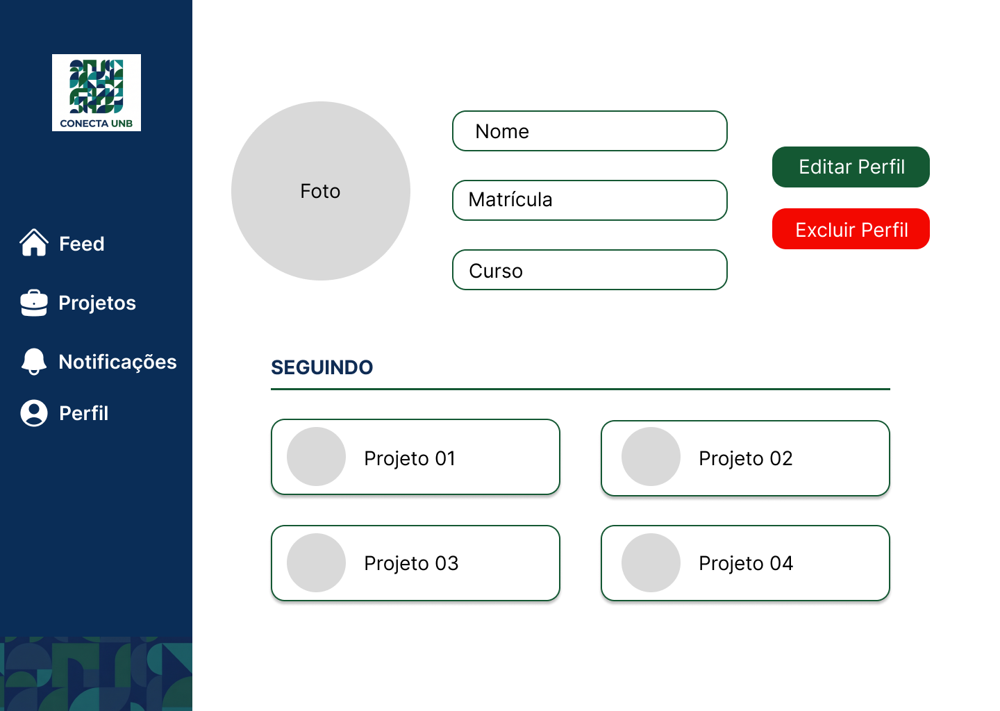

# RF-20: Permitir a visualização dos dados de um perfil de usuário

## Descrição
O sistema deve permitir a visualização dos dados de um perfil de usuário.

## Rastreabilidade

- **RNFs Relacionados:**

**[RNF-01](https://miro.com/app/board/uXjVHTrU614=/?openCardPanel=3458764676223668243)** - Acessar plataforma sem login

**[RNF-03](https://miro.com/app/board/uXjVHTrU614=/?openCardPanel=3458764676223867650)** - Manter consistência visual

Discutido na [fase 1 entrevista 2](../userDesign/Fase1/analiseEntrevista29-04.md)

## Regras de negócio
- [x] **RN1:** O acesso ao perfil só será considerado concluído quando o usuário conseguir visualizar corretamente suas informações cadastradas, incluindo nome, nome de usuário e foto de perfil.
- [ ] **RN2:** O perfil deve ser acessível a partir de qualquer ponto do sistema que contenha o identificador do usuário.

## Protótipo:

## DoR
- [x] O escopo e a regra de negócio estão claros e sem ambiguidades.
- [x] Protótipos aprovados pelos clientes.

## DoD
- [ ] A entrega cumpre com as regras de negócio
- [x] A funcionalidade foi implementada de ponta a ponta (integração entre Next.js e NestJS, não existe entrega apenas de front e back isolados).
- [x] O código foi coberto e aprovado em testes automatizados (utilizando o Jest). Arquivos de teste: [1](https://github.com/mdsreq-fga-unb/REQ-2026.1-T02-ConectaUnB/blob/developer/apps/back/src/perfil/perfil.controller.spec.ts), [2](https://github.com/mdsreq-fga-unb/REQ-2026.1-T02-ConectaUnB/blob/developer/apps/back/src/perfil/perfil.service.spec.ts)
- [x] O código passou por revisões via Pull Requests no GitHub: [PR](https://github.com/mdsreq-fga-unb/REQ-2026.1-T02-ConectaUnB/pull/97): Implementação do perfil de usuário

PREENCHER (essa RN2 ta acontecendo ou não?)