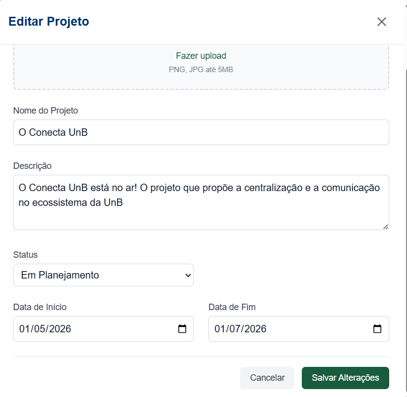

# RF-22: Permitir a publicação de atualizações de projetos podendo conter texto e imagens

## Descrição
Permitir a publicação de atualizações de projetos podendo conter texto e imagens.

## Rastreabilidade

- **RNFs Relacionados:**

**[RNF-03](../RNAOFuncionais/RNF_03.md)** - Manter consistência visual

**[RNF-04](../RNAOFuncionais/RNF_04.md)** - Feedback responsivo

Discutido na [fase 1 entrevista 2](../userDesign/Fase1/analiseEntrevista29-04.md)

## Regras de negócio
- [x] **RN1:** Um projeto deve poder ser associada a uma entidade (EJ, equipe de competição, etc.).
- [x] **RN2:** Cada projeto possui uma descrição associada.
- [x] **RN3:** Deve ser possível editar a foto/banner/nome/descrição/colaboradores de um projeto.

## Protótipo:

## Tela Final (Ao clicar no lápis sobre o card do projeto)

## DoR
- [x] O escopo e a regra de negócio estão claros e sem ambiguidades.
- [x] Protótipos aprovados pelos clientes.

## DoD
- [x] A entrega cumpre com as regras de negócio
- [x] A funcionalidade foi implementada de ponta a ponta (integração entre Next.js e NestJS, não existe entrega apenas de front e back isolados).
- [x] O código foi coberto e aprovado em testes automatizados (utilizando o Jest). Arquivos de teste: [1](https://github.com/mdsreq-fga-unb/REQ-2026.1-T02-ConectaUnB/blob/developer/apps/back/src/postagem/postagem.service.spec.ts), [2](https://github.com/mdsreq-fga-unb/REQ-2026.1-T02-ConectaUnB/blob/developer/apps/back/src/postagem/postagem.controller.spec.ts), [3](https://github.com/mdsreq-fga-unb/REQ-2026.1-T02-ConectaUnB/blob/developer/apps/back/src/projeto/projeto.service.spec.ts), [4](https://github.com/mdsreq-fga-unb/REQ-2026.1-T02-ConectaUnB/blob/developer/apps/back/src/projeto/projeto.controller.spec.ts), [5](https://github.com/mdsreq-fga-unb/REQ-2026.1-T02-ConectaUnB/blob/developer/apps/back/test/app.e2e-spec.ts)
- [x] O código passou por revisões via Pull Requests no GitHub: [PR](https://github.com/mdsreq-fga-unb/REQ-2026.1-T02-ConectaUnB/pull/156)

PREENCHER (ver se fotos estão funcionando)