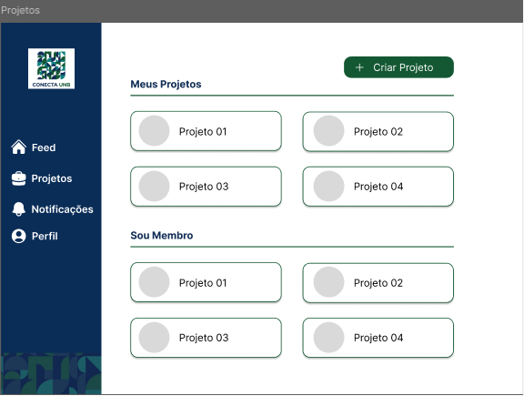

# RF-22: Permitir a publicação de atualizações de projetos podendo conter texto e imagens

## Descrição
Permitir a publicação de atualizações de projetos podendo conter texto e imagens.

## Rastreabilidade
- **Característica do Produto (CP):** 
[CP6] (https://miro.com/app/board/uXjVHTrU614=/?moveToWidget=3458764672594530409&cot=14) - Repositório Histórico de Iniciativas
- **Objetivos (OE):** 
[OE5] (https://miro.com/app/board/uXjVHTrU614=/?moveToWidget=3458764672594530395&cot=14) - Preservar a memória institucional
[OE2] (https://miro.com/app/board/uXjVHTrU614=/?moveToWidget=3458764672594530351&cot=14) - Democratizar e reduzir as barreiras de acesso e busca por meio de navegação pública
[OE3] (https://miro.com/app/board/uXjVHTrU614=/?moveToWidget=3458764672594530364&cot=14) - Promover o portfólio de projetos e tecnologias da universidade para a sociedade civil e o mercado externo
- **RNFs Relacionados:** 
[RNF-03] (https://miro.com/app/board/uXjVHTrU614=/?openCardPanel=3458764676223867650) - Manter consistência visual
[RNF-04] (https://miro.com/app/board/uXjVHTrU614=/?openCardPanel=3458764676223010040) - Feedback responsivo

Discutido na [fase 1 entrevista 2](../userDesign/Fase1/analiseEntrevista29-04.md)

## Regras de negócio
- [ ] **RN1:** Um projeto deve poder ser associada a uma entidade (EJ, equipe de competição, etc.).
- [ ] **RN2:** Cada projeto possui uma descrição associada.
- [ ] **RN3:** Deve ser possível editar a foto/banner/nome/descrição/colaboradores de um projeto.

## Protótipo:

## Tarefas
**Frontend**
- [ ] Criação do Componente/Página de Edição de Projeto.
- [ ] Integrar formulário de atualização (foto, banner, nome, descrição, colaboradores) com a API.
- [ ] Implementar feedback visual de sucesso ou erro na atualização.

**Backend**
- [ ] Atualizar rotas do Modulo Projeto (Criar/revisar rota PATCH/PUT para projetos).
- [ ] Validar permissões de edição para garantir que apenas gestores/membros autorizados editem o projeto.
- [ ] Criação de testes Unitários para Edição de Projetos.
