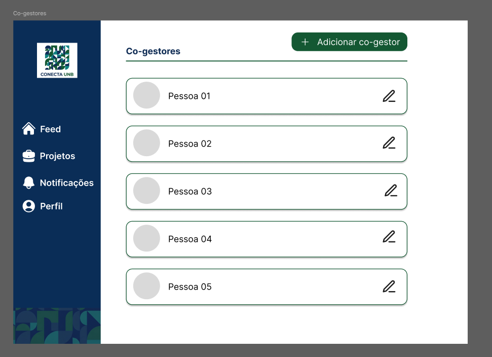
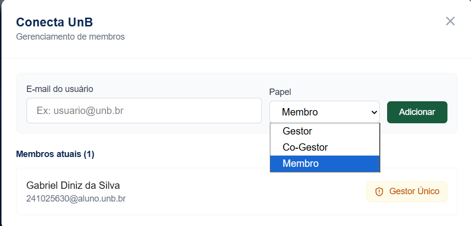

# RF-16.3: Visualizar Co-gestores das entidades

## Descrição
O sistema deve permitir a visualização dos usuários (docentes ou discentes) co-gestores de uma entidade quando a ação for realizada por um usuário que já possua privilégios de gestor ou co-gestor nela.

## Rastreabilidade

- **RNFs Relacionados:**
 
[RNF04](../../RNAOFuncionais/RNF_04.md) - Feedback responsivo

Discutido na [fase 1 entrevista 2](../userDesign/Fase1/analiseEntrevista29-04.md)

## Regras de negócio
- [x] **RN1:** A visualização de co-gestores só será considerado concluída quando o administrador da entidade conseguir ver todos os participantes do perfil da entidade.
- [x] **RN2:** A visualização também deve permitir adicionar ou remover usuários co-gestores.

# Protótipo

## Tela Final

## DoR
- [x] O escopo e a regra de negócio estão claros e sem ambiguidades.
- [x] Protótipos aprovados pelos clientes.

## DoD
- [x] A entrega cumpre com as regras de negócio
- [x] A funcionalidade foi implementada de ponta a ponta (integração entre Next.js e NestJS, não existe entrega apenas de front e back isolados).
- [x] O código foi coberto e aprovado em testes automatizados (utilizando o Jest). Arquivos de teste: [1](https://github.com/mdsreq-fga-unb/REQ-2026.1-T02-ConectaUnB/blob/developer/apps/back/src/entidade/entidade.controller.spec.ts), [2](https://github.com/mdsreq-fga-unb/REQ-2026.1-T02-ConectaUnB/blob/developer/apps/back/src/entidade/entidade.service.spec.ts)
- [x] O código passou por revisões via Pull Requests no GitHub: [PR](https://github.com/mdsreq-fga-unb/REQ-2026.1-T02-ConectaUnB/pull/154)