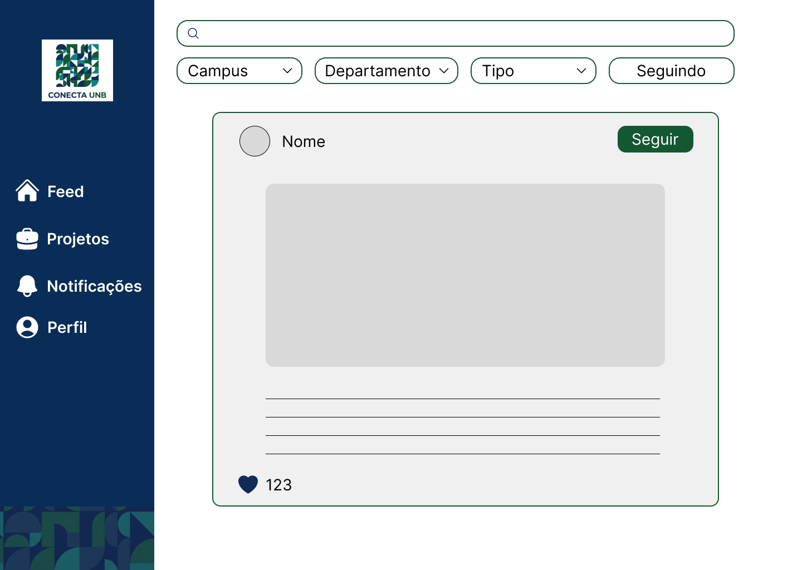

# RF-29: Pesquisar publicações com filtros de busca de capums/área de interesse/tipo da entidade

## Descrição
O sistema deve permitir a busca por posts através de filtros.

## Rastreabilidade
- **RNFs Relacionados:**
[RNF06](../../RNAOFuncionais/RNF_06.md) - Carregamento rápido de páginas

## Regras de negócio
- [x] **RN1:** A busca só será considerada funcional quando retornar publicações compatíveis com pelo menos um dos filtros aplicados pelo usuário.
- [x] **RN2:** O sistema deve permitir filtrar publicações por campus, área de interesse e tipo de entidade.

## Protótipo

## DoR
- [x] O escopo e a regra de negócio estão claros e sem ambiguidades.
- [x] Protótipos aprovados pelos clientes.

## DoD
- [x] A entrega cumpre com as regras de negócio
- [x] A funcionalidade foi implementada de ponta a ponta (integração entre Next.js e NestJS, não existe entrega apenas de front e back isolados).
- [ ] O código foi coberto e aprovado em testes automatizados (utilizando o Jest). Arquivos de teste: 
- [x] O código passou por revisões via Pull Requests no GitHub. [PR](https://github.com/mdsreq-fga-unb/REQ-2026.1-T02-ConectaUnB/pull/165): Acrescenta filtros

PREENCHER: NÃO TEM TESTES