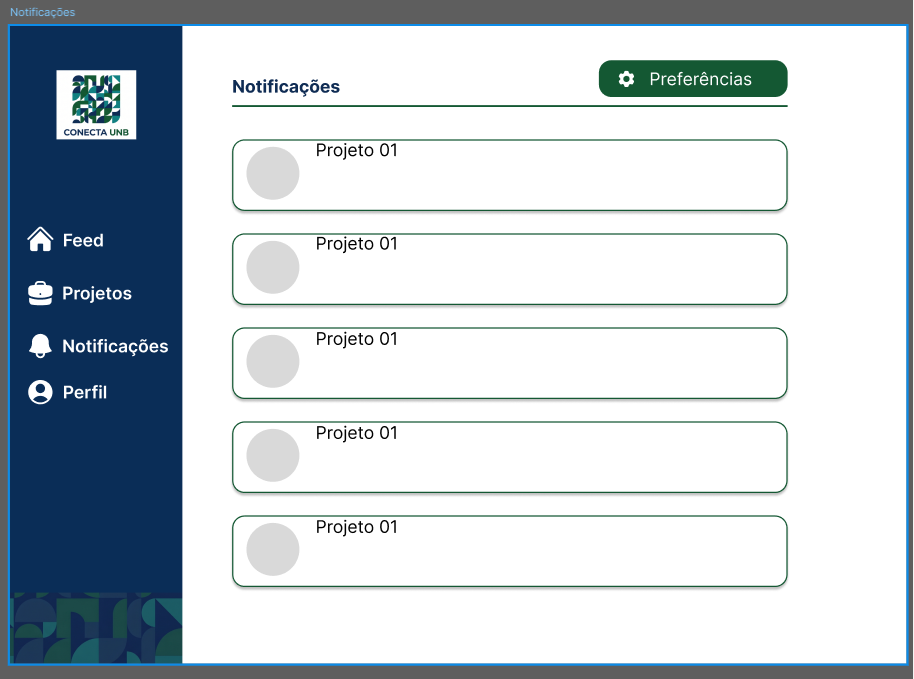

# RF-30: Personalizar preferências de notificação de processo seletivo abertos/publicações/atualização de projetos

## Descrição
O usuário deve poder gerenciar suas preferências de notificação escolhendo quais tipos de alertas receber.

## Rastreabilidade

- Discutido na [fase 1 entrevista 1](../../userDesign/Fase1/analiseEntrevista24-04.md)
- Discutido na [fase 1 entrevista 2](../../userDesign/Fase1/analiseEntrevista29-04.md)

## Regras de negócio
- [x] **RN1:** O sistema deve permitir que o usuário configure suas preferências de notificação.
- [x] **RN2:** O sistema deve oferecer a ativação ou desativação dos tipos de notificação disponíveis.
- [x] **RN3:** Ao salvar as alterações, o sistema deve atualizar as preferências no banco de dados e aplicá-las imediatamente nos próximos envios.

## DoR
- [x] O escopo e a regra de negócio estão claros e sem ambiguidades.
- [x] Protótipos aprovados pelos clientes.

## DoD
- [x] A entrega cumpre com as regras de negócio
- [x] A funcionalidade foi implementada de ponta a ponta (integração entre Next.js e NestJS, não existe entrega apenas de front e back isolados).
- [x] O código foi coberto e aprovado em testes automatizados (utilizando o Jest). Arquivos de teste: [1](https://github.com/mdsreq-fga-unb/REQ-2026.1-T02-ConectaUnB/blob/developer/apps/back/src/notificacao/notificacao.service.spec.ts), [2](https://github.com/mdsreq-fga-unb/REQ-2026.1-T02-ConectaUnB/blob/developer/apps/back/src/notificacao/notificacao.controller.spec.ts)
- [x] O código passou por revisões via Pull Requests no GitHub: [PR1](https://github.com/mdsreq-fga-unb/REQ-2026.1-T02-ConectaUnB/pull/159): Front das notificações, [PR2](https://github.com/mdsreq-fga-unb/REQ-2026.1-T02-ConectaUnB/pull/163): Termina implementação das notificações