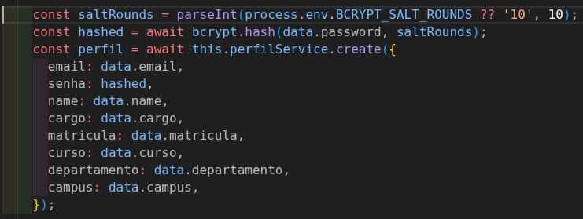
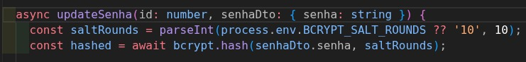
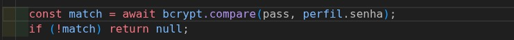

# RNF-08: Criptografar senhas dos usuários

### Requisito externo

## Descrição
O sistema deve criptografar os senhas dos usuários.

## Rastreabilidade

LGPD

## Regras de negócio
- [x] **RN1:** Todas as senhas devem ser salvas de forma irreversível no banco de dados utilizando função de hash (bcrypt padrão do NestJS).

**Fotos com Evidências**

  
<strong>Figura 1</strong> - Código no Cadastro

  
  

---

  
<strong>Figura 2</strong> - Código no Trocar senha

  
  

---

  
<strong>Figura 3</strong> - Código no Login

  
  

