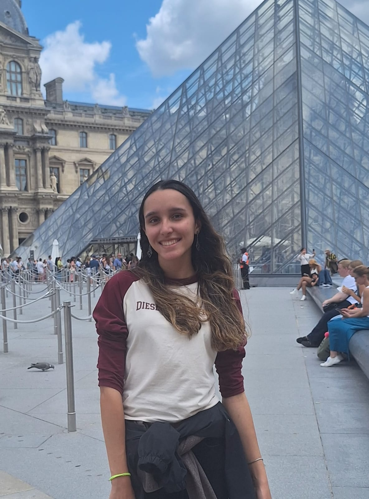
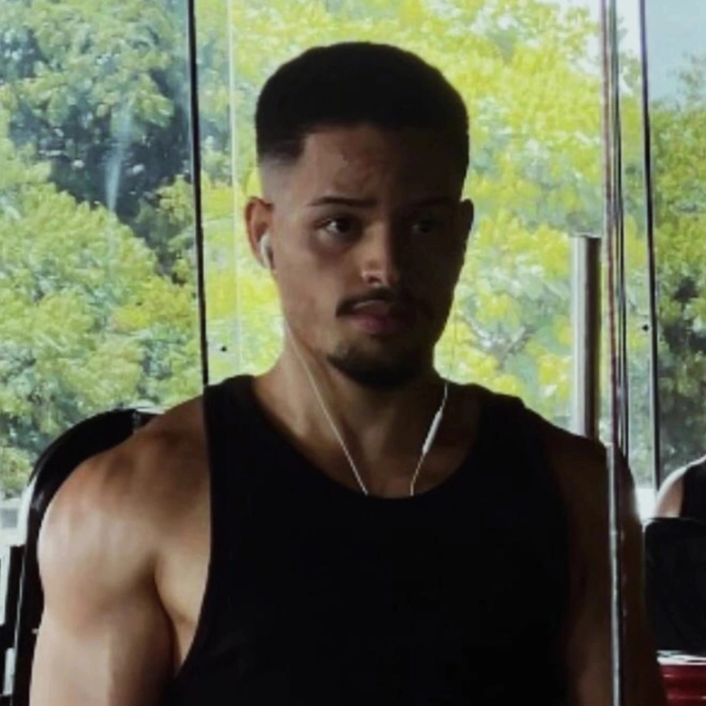
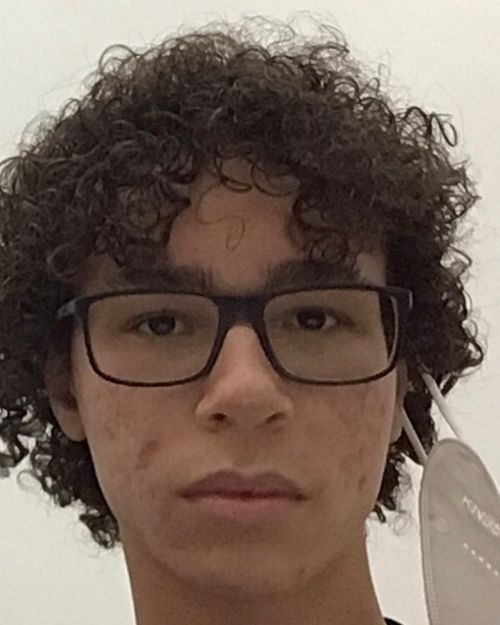
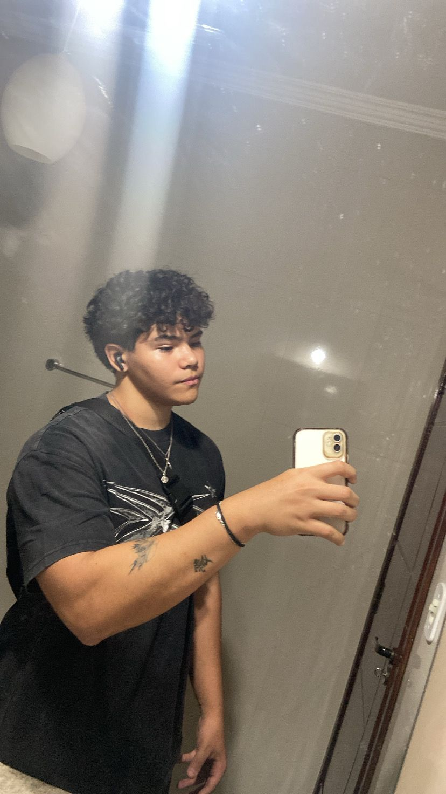
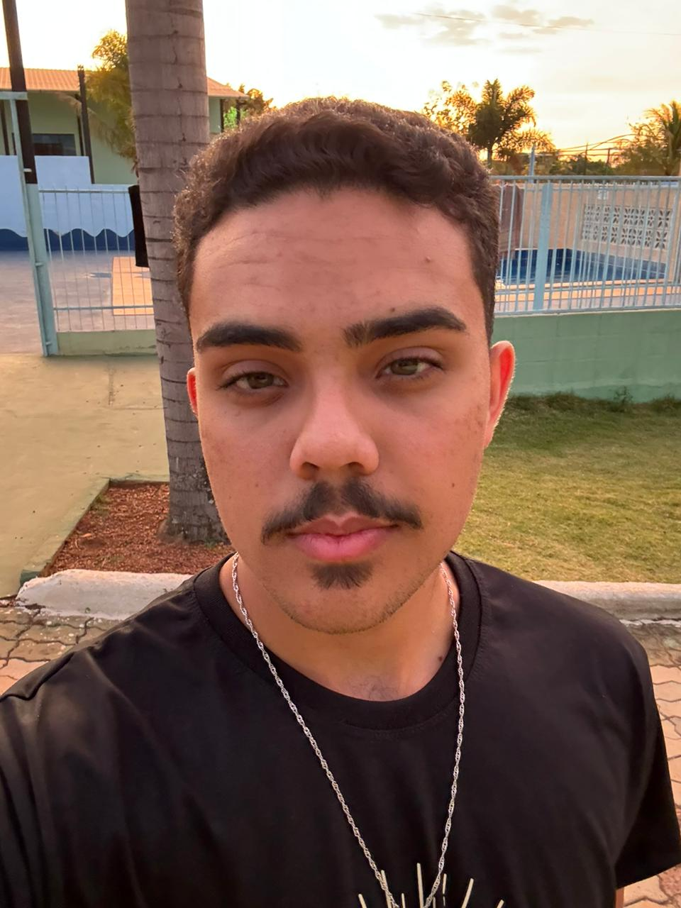

Somos estudantes da **Universidade de Brasília (UnB) | Faculdade de Ciências e Tecnologias em Engenharia (FCTE)** e este projeto está sendo desenvolvido no contexto da disciplina de **Requisitos de Software**, ministrada pelo professor e doutor **George Marsicano Correia**, sendo o nome escolhido para o grupo **Capoeira**.

O **Conecta UnB** é uma plataforma digital integradora concebida para centralizar a comunicação e as oportunidades dentro do ecossistema acadêmico da Universidade de Brasília (UnB), buscando democratizar o acesso à informação na universidade, impulsionar o engajamento dos estudantes em projetos práticos, reduzir o trabalho de divulgação das entidades e preservar a memória institucional das organizações acadêmicas.

## Integrantes

### Grupo 04

| {: .foto-equipe } | {: .foto-equipe } | {: .foto-equipe } | {: .foto-equipe } | {: .foto-equipe } | {: .foto-equipe } | 
|:-:|:-:|:-:|:-:|:-:|:-:|
| [Gabriel Diniz](https://github.com/GabrielDiniz12) | [Giovanna Brito](https://github.com/giovannabrito19) | [Gustavo Abrantes](https://github.com/GustaaSz) | [João Pedro](https://github.com/ojplc) | [Mathues Lemes](https://github.com/matheuslemesam) | [Pedro Américo](https://github.com/dev-americo) |

