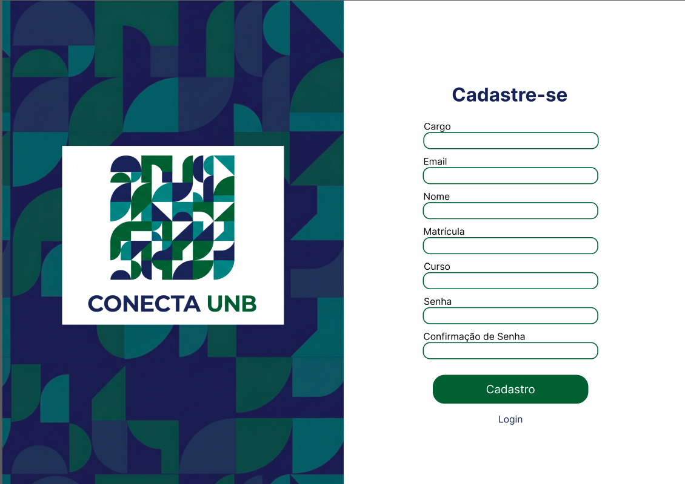
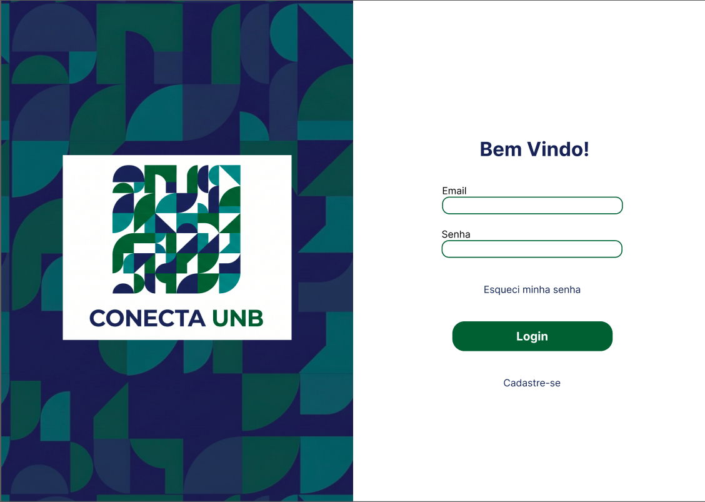
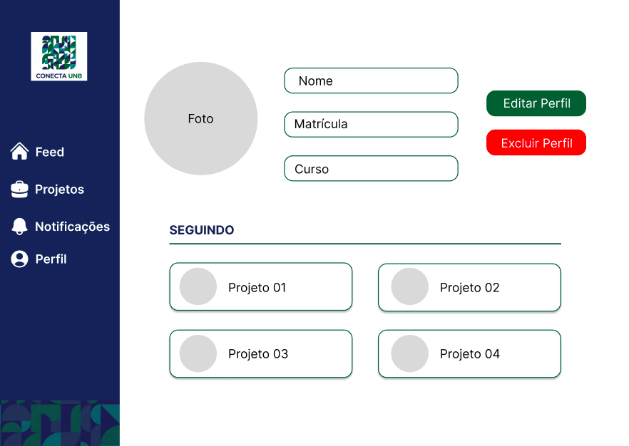
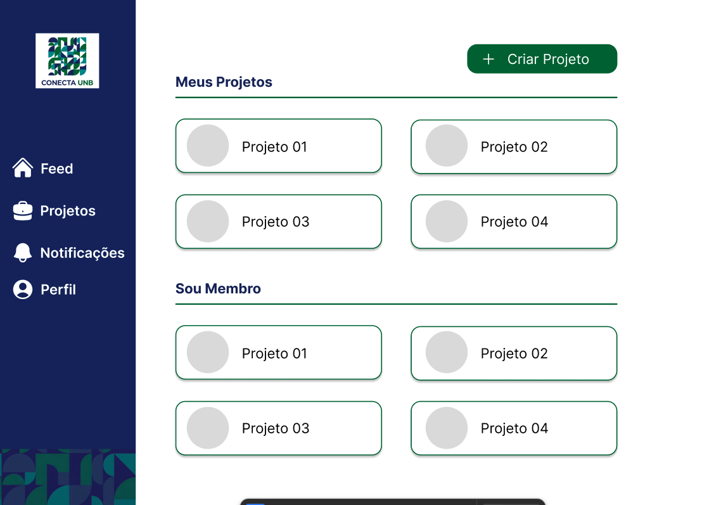
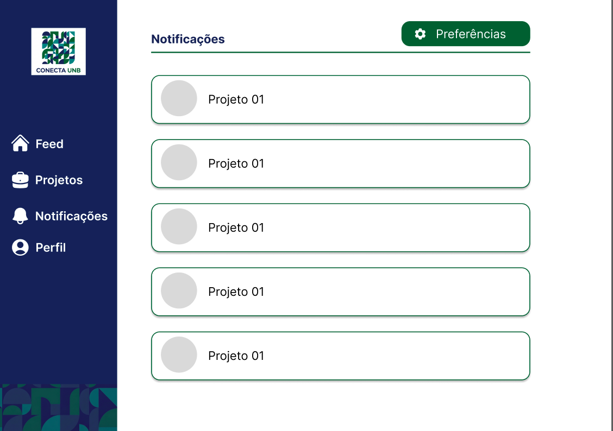
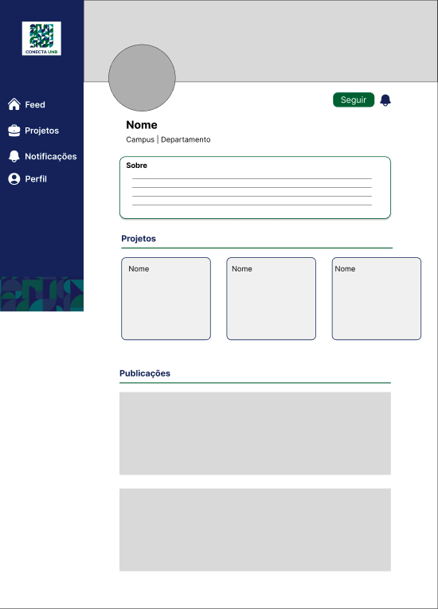
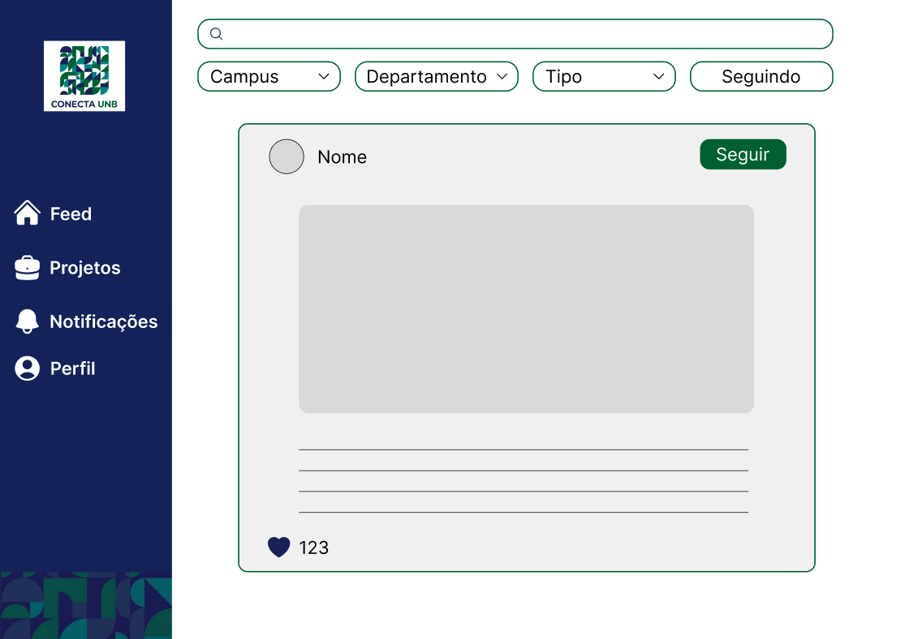

## Introdução

Neste artefato alocamos a representação dos requisitos por meio de Protótipos de Média Fidelidade para entrarmos em acordo com o RAD.

### Login

**Aborda os requisitos**

- RF-20

### Cadastro

**Aborda os requisitos**

- RF-17

### Recuperar Senha

**Aborda os requisitos**

- RF-18
- RF-20

### Perfil

**Aborda os requisitos**

- RF-18
- RF-19
- RF-20

### Projetos

**Aborda os requisitos**

- RF-12
- RF-15
- RF-16.1
- RF-16.2
- RF-16.3
- RF-16.4
- RF-21

### Notificação

**Aborda os requisitos**

- RF-30

### Entidade

**Aborda os requisitos**

- RF-03
- RF-04
- RF-05
- RF-13
- RF-14
- RF-15
- RF-22
- RF-23
- RF-24
- RF-25
- RF-26
- RF-27
- RF-28
- RF-31
- RF-32
- RF-33

### Feed

**Aborda os requisitos**

- RF-01
- RF-02
- RF-06
- RF-07
- RF-08
- RF-09
- RF-10
- RF-11
- RF-29