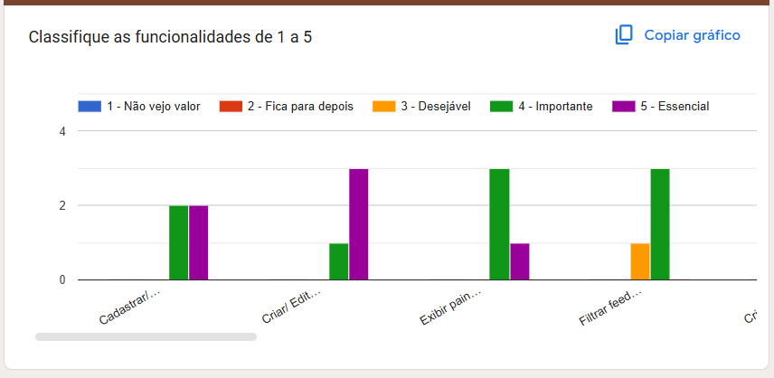
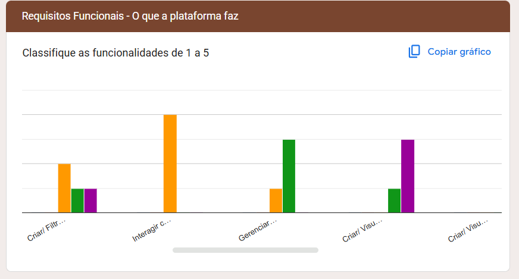
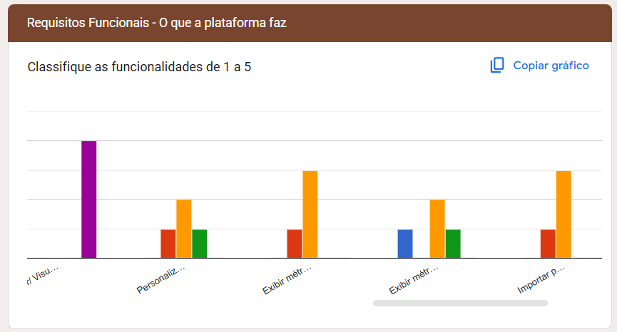
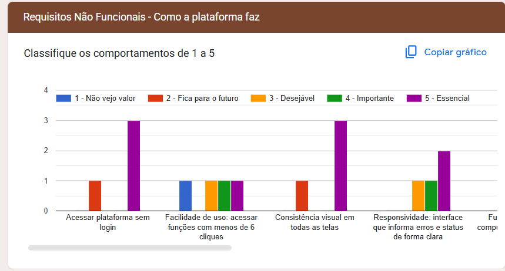
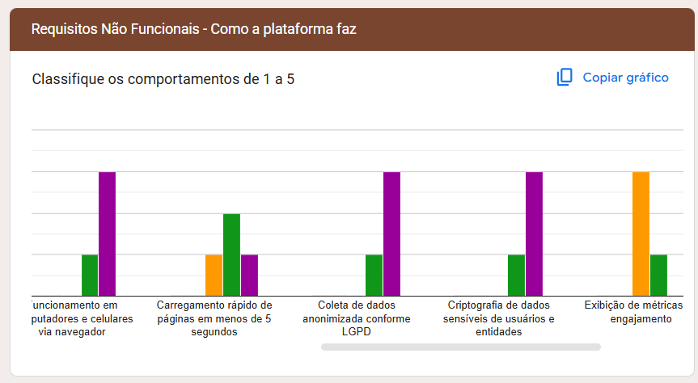
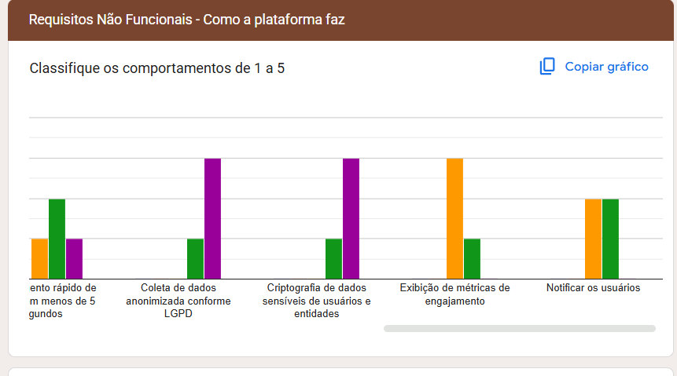

## Evidências forms

O grupo enviou um forms aos stakeholders para que eles pudessem determinar o valor de negócio de cada funcionalidade. Após eles responderem nós fizemos a média das respostas para formar a nossa matriz de valor de negócio x esforço

