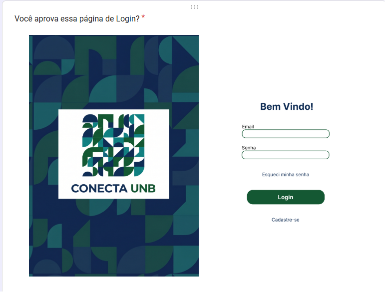
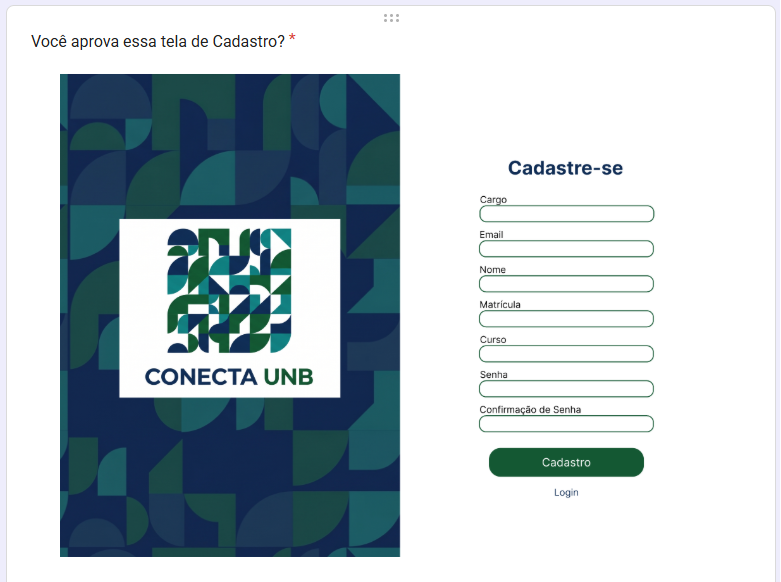
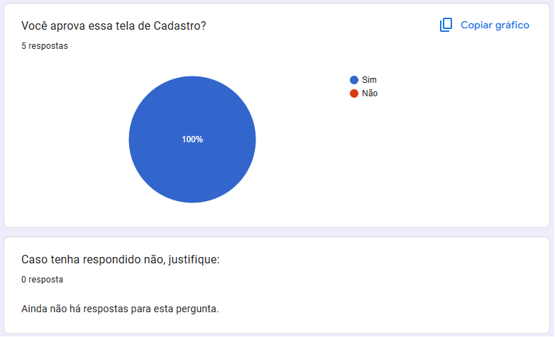
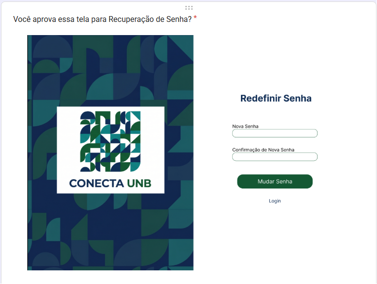
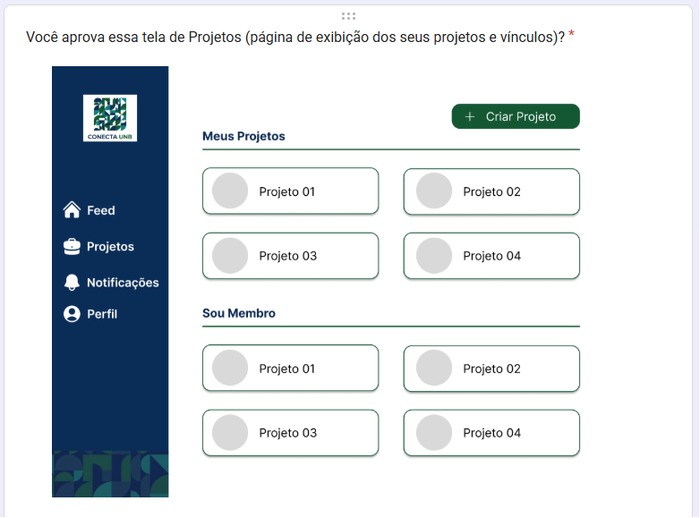
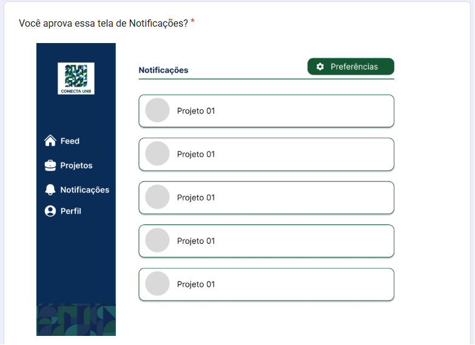
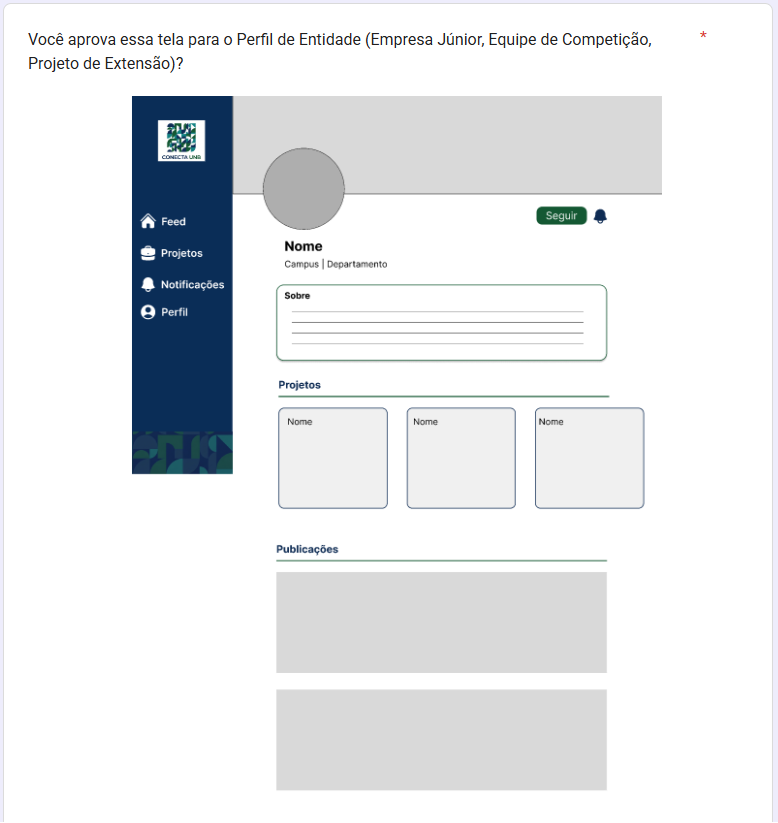

## Evidências Critérios de aceitação

Evidências do formulário para validação dos prótotipos criados após a primeira versão.

**OBS:** A divergência na tela de notificação e tela de projetos já foi resolvida com o stakeholder, houve apenas um mal entendido.
