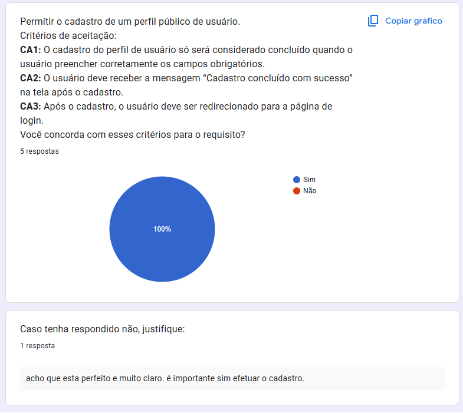
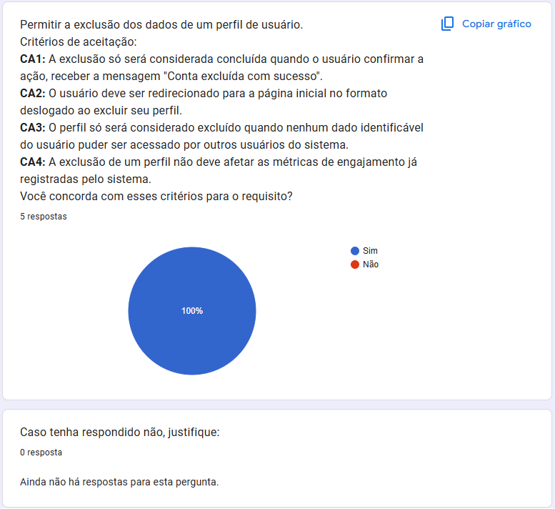
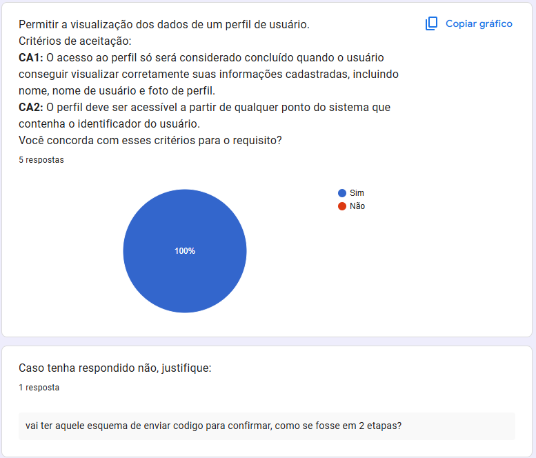
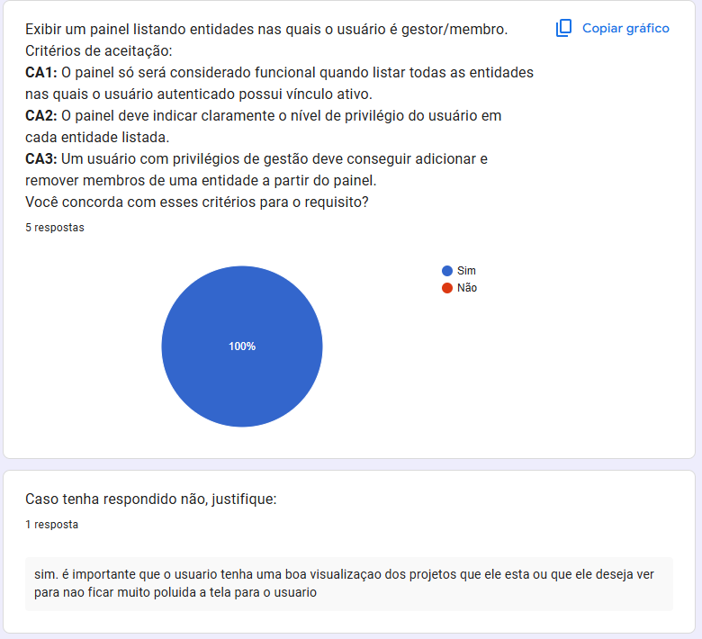
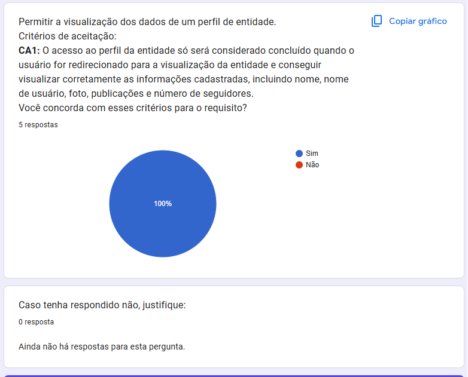
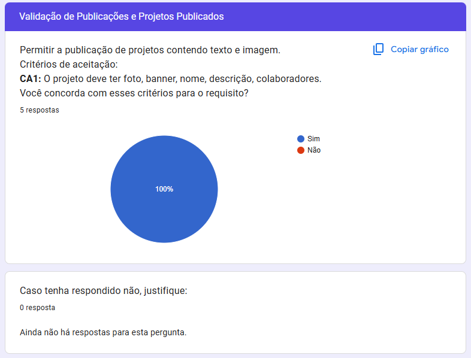
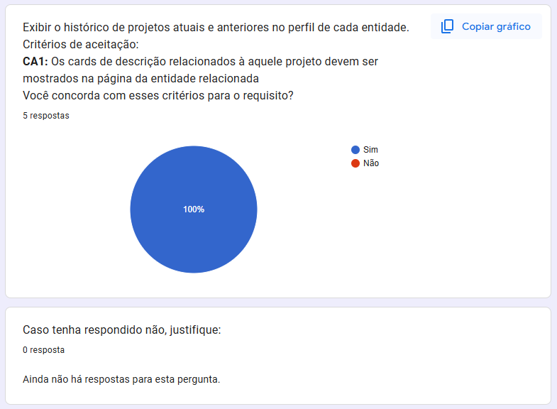
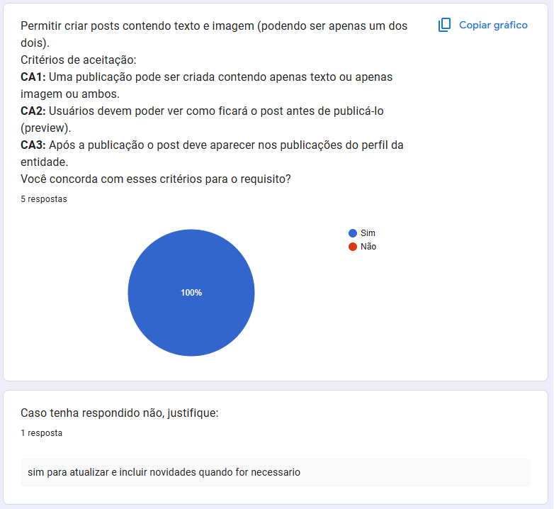
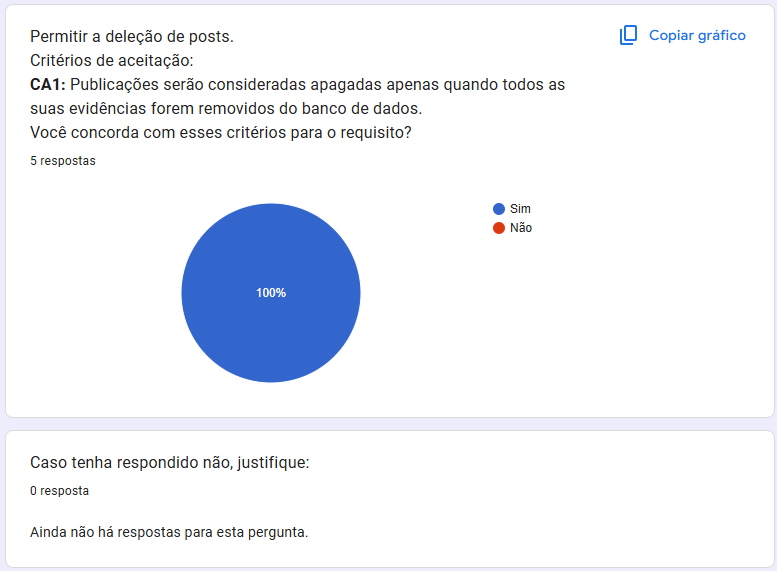

## Introdução

Abaixo estão descritas as evidências de validação dos critérios de aceitação dos Temas do Backlog:

- Perfil Usuario (RF-17 a RF-20)
- Perfil entidade (RF-12 a RF-15)
- Projetos (RF-24 a RF-25)
- Publicações (RF-26 a RF-28)

## Fotos das respostas do Formulário

