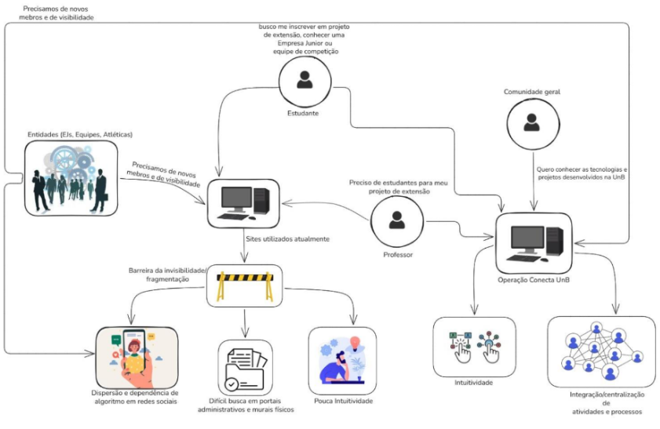
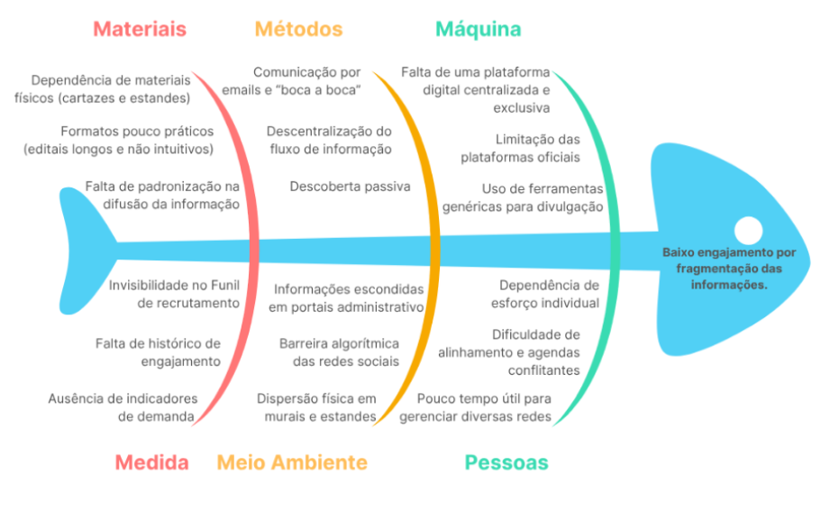

# Cenário Atual do Cliente e do Negócio

## Identificação dos Clientes/Parceiros 

Diante da tarefa de atender um público heterogêneo, pois a utilização da plataforma abarcaria tanto discentes e docentes da UnB como um público externo, a distribuição dos stakeholders e dada por: 

### Clientes Principais 

Esse Grupo abarca os stakeholders que irão definir o que o sistema deve ter para atender as necessidades de cada nicho, sendo papel dos desenvolvedores mediar essas necessidades. 

- **Nome:** Catavento; 
- **Tipo:** Projeto de Extensão ligado a UnB - FCTE 
- **Representante:** Paula Meyer Soares (Docente da UnB e Fundadora do projeto de Extensão Catavento) 
- **Forma de Contato:** Reuniões Periódicas por videoconferência e canal de mensagens instantâneas. 
- **Vínculo com o Projeto:** Sendo Docente da UnB e representando as necessidades de professores que possuem projetos de extensão, será uma das responsáveis por validar as decisões de projeto bem como as entregas e identificação junto a equipe para elicitação e descoberta de requisitos. 

---

- **Nome:** Gama CubeDesign. 
- **Tipo:** Equipe de Competição. 
- **Representante:** João Pedro Fernandes (Atual capitão da equipe, graduando do curso Engenharia Aeroespacial pela FCTE). 
- **Forma de contato:** Reuniões periódicas por videoconferência, ou encontros pessoais rápidos e canal direto de mensagens. 
- **Vínculo com o Projeto:** Em conversa com o representante apresentamos parte da nossa proposta e ele concordou que ter um lugar específico para que as equipes de competição e outros grupos possam postar informações sobre processos seletivos e eventos, seria de muito ajuda para a comunicação deles, que em palavras do próprio João, hoje é pouco eficiente. 

---

- **Nome:** Pesadelo. 
- **Tipo:** Atlética 
- **Representante:** Matheus Eiki Kimura Rezende (Atual vice-presidente da equipe). 
- **Forma de contato:** Reuniões periódicas por videoconferência, ou encontros pessoais rápidos e canal direto de mensagens. 
- **Vínculo com o Projeto:** Em conversa com o representante, após apresentarmos a proposta, ele acredita que o Conecta UnB colaboraria para uma diminuição do trabalho de marketing, unificando a forma de expressão das oportunidades, sem necessidade de reformatação para diferentes meios de comunicação. Além de favorecer a claridade das informações no que tange aos diferentes formulários que a atlética tem disponíveis (seleção de atletas, seleção para gestão, formulário para compra de produtos, etc) 
 
---

- **Nome:** CJR.
- **Tipo:** Empresa Júnior 
- **Representante:** João Moreira (Atual Diretor do Núcleo de Imagem e Publicidade da Empresa Júnior e graduando do curso de Engenharia de Software pela FCTE) 
- **Forma de contato:** Reuniões periódicas por videoconferência, ou encontros pessoais rápidos e canal direto de mensagens. 
- **Vínculo com o Projeto:** Em conversa com o representante, apresentamos parte da proposta, que foi considerada interessante como forma de ampliar a divulgação dos trabalhos e dos processos seletivos da empresa. 

### Parceiros:
O grupo comporta stakeholders que irão interagir com o sistema, tendo em vista o grande número de parceiros estratégicos, a presença desse grupo garante que o sistema desenvolvido atenda o público geral que vai utilizar a plataforma.

- **Nome:** Discentes UnB; 
- **Tipo:** Corpo discente e comunidade acadêmica em geral. 
- **Representante:** Yan Luca Viana de Araújo Fontenele (Faz parte do corpo discente e é graduando em Engenharia de Software pela FCTE). 
- **Forma de contato:** Reuniões Periódicas por videoconferência e canal de mensagens instantâneas. 
- **Vínculo com o projeto:** Cliente real e umas das partes interessadas que representa o perfil de usuário base do Conecta UnB. Será um dos responsáveis por elicitar, validar requisitos e decisões do projeto, além de avaliar as entregas realizadas ao longo do desenvolvimento. 

## Introdução ao Negócio e Contexto 

A Universidade de Brasília (UnB) é uma instituição federal de ensino superior, pública e autárquica, referência nacional em pesquisa e inovação. Desde sua fundação em 1962, a UnB preza pela integração entre ensino, pesquisa e extensão. Atualmente, a instituição opera de forma descentralizada em quatro unidades: Darcy Ribeiro (Plano Piloto), Ceilândia, Planaltina e o campus do Gama (FCTE). Este último, com forte vocação para as engenharias e tecnologias, abriga um ecossistema acadêmico altamente ativo, composto por projetos de extensão, oportunidades em Empresas Juniores (EJs) e equipes de competição. 

Historicamente, a universidade possui uma produção de extensão vasta e heterogênea. Porém, a comunicação e a divulgação dessas atividades ocorrem de forma extremamente fragmentada. No cenário atual, as informações institucionais e de recrutamento encontram-se dispersas em murais físicos de difícil acesso, em perfis isolados de redes sociais (Instagram/LinkedIn) , que dependem de algoritmos para entrega e em editais no formato de PDFs pouco intuitivos, frequentemente escondidos em portais administrativos, como o do Decanato de Extensão da UnB, que hoje é uma solução que não integra 100%, pois como exemplo, não contém uma página dedicada as Ejs, Atléticas, equipes de competição, etc. 

Essa descentralização e a falta de padronização informacional dificultam significativamente a visibilidade da produção acadêmica. O modelo atual de divulgação cria barreiras práticas para que os alunos descubram os projetos existentes e engajem-se em novas oportunidades, além de impedir que a sociedade civil compreenda com clareza o retorno social dos investimentos aplicados na universidade. 

Nesse contexto de fragmentação da informação, as partes afetadas podem ser destacadas em dois grandes grupos: o público interno (discentes, docentes e entidades acadêmicas) e o público externo da Universidade de Brasília (mercado e comunidade em geral). 

## Rich Picture 

  
<strong>Figura 1</strong> - Rich Picture

  
  

## Identificação da Oportunidade ou Problema 

Há um problema na divulgação das atividades extensionistas da UnB - FCTE. Atualmente, entidades como pesquisadores, empresas juniores e equipes de competição recorrem a meios de divulgação antigos com baixo alcance, como cartazes físicos, conversas e estandes na faculdade, ou a redes sociais genéricas. Como essas plataformas sociais não possuem uma divulgação exclusiva para o tema acadêmico, os grupos ficam dependentes de os interessados já estarem seguindo suas contas, tornando-se reféns do pouco alcance orgânico e das barreiras impostas pelos algoritmos. 

Esse cenário é reforçado pelo relato de uma das clientes, a Professora Paula Meyer, que aponta a ausência de uma divulgação adequada dos projetos de extensão. Hoje, as atividades e os resultados desses projetos acabam ofuscados e difusos, fazendo com que e-mails longos e a transmissão verbal sejam as principais formas de os alunos tomarem conhecimento das iniciativas. 

A grande barreira é que não há uma página dedicada a cada projeto no site do Decanato de Extensão da UnB. As plataformas oficiais atuais apresentam limitações significativas, pois não oferecem recursos essenciais para o engajamento, como: a impossibilidade de exposição de fotos em uma página própria, um nível adequado de personalização de páginas dedicadas e a possibilidade de realizar postagens contínuas. Consequentemente, a ausência de uma divulgação centralizada, que conte com uma interface moderna e intuitiva, dificulta bastante a propagação de editais e a gestão de processos de inscrição para a comunidade acadêmica e para a sociedade em geral. 

 

  
<strong>Figura 2</strong> - Diagrama Ishikawa

  
  

 

 
## Desafios do Projeto 

O principal desafio técnico do projeto está na integração e centralização de informações provenientes de diferentes setores da universidade, como empresas juniores, atléticas, equipes de competição, projetos de extensão, iniciação científica (PIBIC, PIBEX, PIBITI), Trabalhos de Conclusão de Curso (TCCs), monitorias e tutorias. Como essas informações atualmente se encontram dispersas e organizadas de formas distintas, será necessário padronizar os dados e garantir que a plataforma consiga reuni-los de maneira estruturada, atualizada e de fácil acesso.  

Além disso, há o desafio relacionado à adesão dos diferentes representantes da universidade, como alunos, professores e membros de organizações acadêmicas. Nesse sentido, será necessário incentivar o uso da plataforma e garantir que ela se mantenha relevante, com informações constantemente atualizadas.  

Outro obstáculo importante está relacionado à disponibilidade de agenda, tanto da equipe de desenvolvimento quanto dos stakeholders. Como todos os envolvidos possuem diferentes compromissos, pode haver dificuldade em encontrar horários em comum, o que impacta a realização de reuniões síncronas e o alinhamento contínuo do projeto. Ainda nesse contexto, a equipe também enfrenta o desafio de conciliar as demandas do projeto com outras atividades acadêmicas, especialmente em períodos em que há coincidência de prazos.  

Ademais, destaca-se como um possível desafio conciliar as diferentes visões dos grupos envolvidos. Considerando a participação de múltiplos perfis, como alunos, professores, empresas juniores, equipes de competição e atléticas, podem surgir divergências quanto às necessidades, prioridades e expectativas em relação à plataforma, exigindo a mediação e priorização de demandas para atender, de forma equilibrada, à comunidade acadêmica. 

Por fim, o projeto pode enfrentar limitações de tempo e recursos, tornando necessária a priorização das funcionalidades essenciais (MVP) para garantir a entrega de uma solução viável e de valor dentro do prazo estabelecido pela disciplina.

## Mapa de Stakeholders 

Os stakeholders do projeto Conecta UnB estão intimamente relacionados tanto ao público interno quanto ao externo da instituição. Por sua vez, o público interno abrange os seguintes stakeholders:  

- **O corpo docente:** Professores coordenadores que necessitam de um canal eficiente para atrair voluntários, bolsistas e parceiros estratégicos.  
- **O corpo discente:** Alunos que buscam engajamento prático em projetos de extensão. 
- **Entidades estudantis:** Seriam as empresas juniores (EJs) e ligas acadêmicas que buscam profissionalizar sua imagem e centralizar processos seletivos. 

Já o segundo grupo de stakeholders é o público externo: 

- **Comunidade em Geral:** Cidadãos interessados nos serviços prestados pela universidade e na transparência sobre a produção científica e social. 
- **Empresas e Investidores:** Organizações que buscam talentos, parcerias tecnológicas com equipes de competição ou contratação de consultorias via Empresas Juniores. 

Abaixo são apresentados mais detalhes de quem serão os stakeholders que irão acompanhar, validar, elicitar e ajudar no processo de descoberta de novos requisitos durante o desenvolvimento do projeto. 

Os stakeholders do projeto Conecta UnB englobam representantes de todas as frentes acadêmicas e extracurriculares do campus. Como representantes dos clientes e usuários finais, temos os Discentes da UnB (representados por Yan Luca), que terão o papel de validar as entregas e requisitos com base na necessidade de encontrar oportunidades. 

Do lado dos publicadores de conteúdo e oportunidades, o projeto contará com a visão docente, focada em extensão, representada pelo projeto Catavento coordenado pela docente Paula Meyer Soares. Por outro lado, com as demandas de visibilidade e recrutamento técnico das equipes de competição, temos a representação da equipe Gama CubeDesign (representada por João Pedro).

Quanto à necessidade de divulgação de eventos e engajamento esportivo das Atléticas, temos a representação da atlética Pesadelo (representada por Matheus Eiki Kimura Rezende). A busca por ampliação do alcance institucional e de processos seletivos profissionais será representada pela Empresa Júnior CJR (João Moreira como representante). Por fim, a equipe de desenvolvimento será a responsável por elicitar, projetar e implementar a solução técnica que integrará todos esses atores. 

<b>Tabela 1</b> - Stakeholders

| Stakeholders | Relação com a solução | Interesse principal | Influência |
| :--- | :--- | :--- | :--- |
| **Discentes UnB** (Rep: Yan Luca) | Usuário final (consumidor de informações). | Buscar oportunidades de engajamento de forma centralizada, validar os requisitos, escopo e entregas do projeto. | Média |
| **Docentes / Projeto Catavento** (Rep: Paula Meyer Soares) | Produtores de conteúdo e validadores. | Expor projetos de extensão, captar alunos e validar as decisões de escopo e elicitação. | Alta |
| **Gama CubeDesign** (Rep: João Pedro) | Produtores de conteúdo e validadores. | Ter um canal eficiente e específico para comunicar processos seletivos e eventos da equipe. | Alta |
| **Atlética Pesadelo** (Rep: Matheus Eiki Kimura Rezende) | Produtores de conteúdo e validadores. | Divulgar atividades, seletivas esportivas e eventos para engajar a comunidade acadêmica. | Alta |
| **Empresa Júnior CJR** (Rep: João Moreira) | Produtores de conteúdo e validadores. | Ampliar a divulgação institucional, dos portfólios de trabalho e dos processos seletivos da empresa. | Alta |
| **Equipe de Desenvolvimento** | Responsáveis pela construção do produto. | Entregar um sistema viável, de qualidade e que resolva o problema de fragmentação de informações. | Alta |

## Segmentação de Clientes 

Os usuários da aplicação estão separados entre quatro grandes grupos:  

- **Estudantes Universitários:** É composto por discentes que buscam enriquecer sua formação e conhecer atividades que vão além da sala de aula. Esse segmento busca horas complementares, oportunidades de adquirir experiência prática, aprofundamento por meio de pesquisas e meios de socialização. Entretanto, esse grupo sofre com a fragmentação das informações. 

- **Entidades Estudantis:** Esse grupo é formado principalmente pelas empresas juniores, equipes de competição e atléticas, que operam de maneira organizada. Esse segmento tem a necessidade constante de atrair novas pessoas, promover eventos e fortalecer a imagem da entidade na faculdade, porém sofre com a dependência de algoritmos de redes sociais para alcançar os calouros e o público em geral. 

- **Coordenadores de projetos:** São docentes e pesquisadores responsáveis por projetos de extensão, iniciação científica e laboratórios. Esse segmento precisa captar alunos voluntários ou bolsistas para viabilizar suas pesquisas e cumprir com o papel de retorno social da universidade. Eles necessitam de um canal intuitivo e organizado, buscando uma alternativa às trocas de email e aos murais físicos. 

- **Comunidade Externa:** Pessoas de fora da universidade, profissionais e empresas. Esse segmento tem interesse em consumir o que a universidade produz, seja contratando serviços, patrocinando equipes de competição ou participando de eventos abertos ao público. 