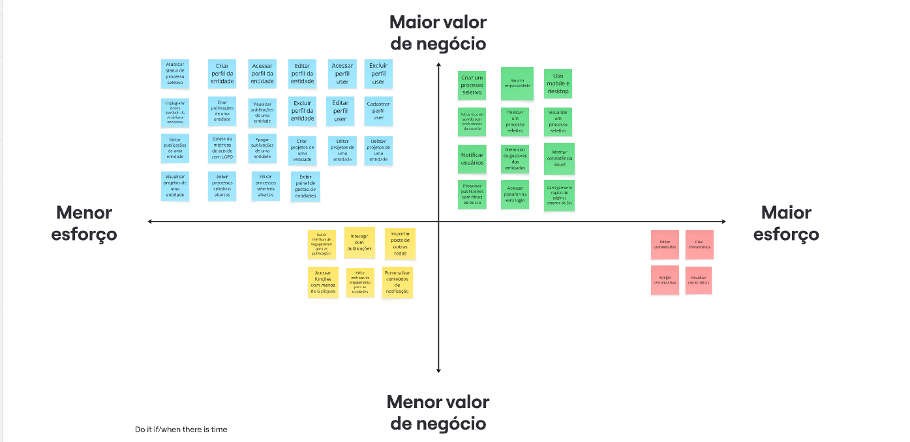
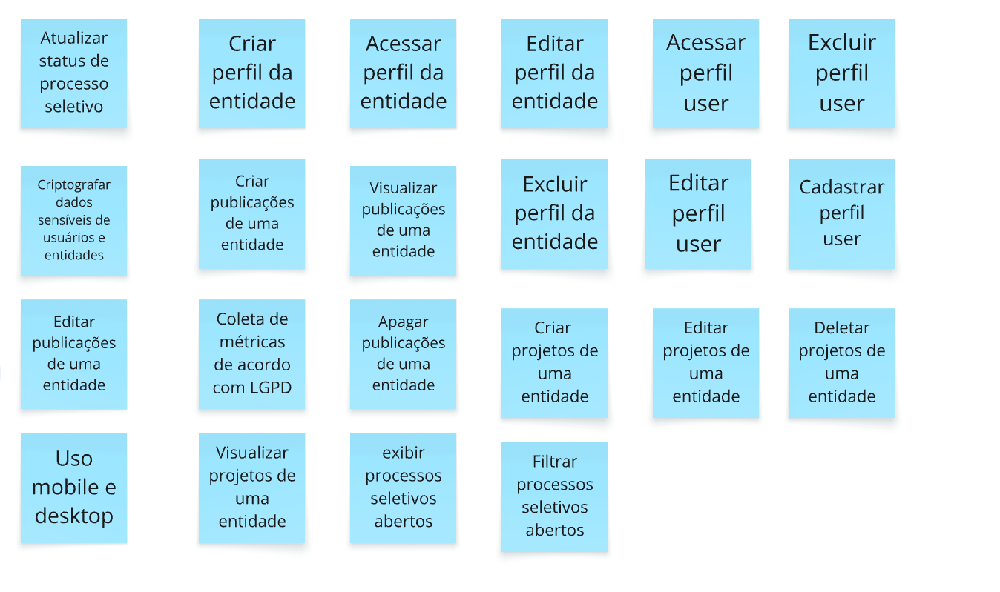
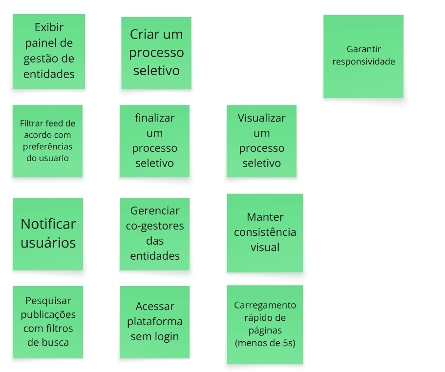
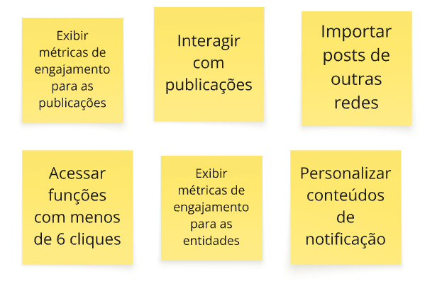
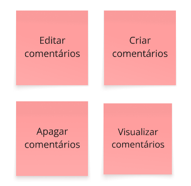

## Introdução

Após a primeira fase de elicitação e descoberta o grupo declarou os requisitos entendidos e subentendidos das três entrevistas e os reuniu na seguinte tabela:

## Requisitos funcionais (RFs)

| Cod | Nome | Texto estruturado | Característica do produto | Rastreabilidade Entrevistas | Priorização MoSCoW | Critérios de aceitação |
| ------ | ------ | ------ | ------ | ------ | ------ | ------ |
| **PROCESSOS SELETIVOS** |  |  |  |  |  |  |
| **RF-01** | Exibir processos seletivos abertos | O sistema deve permitir exibir todos os procesos seletivos abertos | CP5 Mecanismo de Busca e Filtragem | RF-1-01 | Must Have | **CA1:** Apenas usuários autenticados podem se cadastrar em processos seletivos.   **CA2:** Apenas processos com a data de término igual ou superior à data atual devem ser exibidos nesta listagem. |
| **RF-02** | Filtrar processos seletivos abertos | O sistema deve permitir filtrar processos seletivos abertos | CP5 Mecanismo de Busca e Filtragem | RF-1-01 | Must Have | **CA1:** O sistema deve filtrar os processos seletivos abertos quando o usuário aplicar um ou mais parâmetros de categorização na busca, exibindo apenas as categorias selecionadas. |
| **RF-03** | Atualizar status de um processo seletivo | O sistema deve permitir a atualização do status de um processo seletivo de uma entidade | CP4 Publicações independentes | RF-1-06 | Must Have | **CA1:** O sistema deve atualizar o status de um processo seletivo apenas para usuários com privilégios de gestor  **CA2** O usuário deverá escolher classificações de status pré definidas (aberto, finalizado, etc.). |
| **RF-04** | Finalizar um processo seletivo | O sistema deve permitir a finalização de um processo seletivo de uma entidade | CP4 Publicações independentes | RF-1-07 | Must Have | **CA1:** O sistema deve finalizar um processo seletivo quando o gestor da entidade confirmar a ação de finalização.   **CA2:** Seu estado deve ser alterado para "Finalizado" |
| **RF-05** | Criar um processo seletivo | O sistema deve permitir a criação de um processo seletivo de uma entidade delimitando data limite para inscrição | CP4 Publicações independentes | RF-1-07 | Must Have | **CA1:** O sistema deve criar um processo seletivo quando o gestor da entidade submeter o formulário preenchido corretamente.   **CA2:** É necessário delimitar uma data de término de inscrição válida. |
| **FEED** |  |  |  |  |  |  |
| **RF-06** | Filtrar feed em relação a capums/área de interesse/tipo da entidade | O sistema deve permitir a configuração de filtros de interesses pessoais (ex: equipes de competição, PIBIC) para personalizar o feed de visualização. | CP5 Mecanismo de Busca e Filtragem | RF-2-05 | Should Have | **CA1:** O sistema deve filtrar as publicações do feed quando o usuário autenticado tiver filtros de interesses pessoais configurados, restringindo a exibição exclusivamente às postagens que possuam as tags ou categorias correspondentes às suas preferências. **CA2:** Os filtros disponíveis devem refletir apenas as características presentes no banco de dados (se não houver uma instituição EJ no banco então esse filtro não deve estar disponível)|
| **RF-07** | Criar comentários em publicações | O sistema deve permitir que usuários autenticados criem e adicionem comentários em texto nas publicações do feed. | CP2 Feed de visualização | vídeo validação de desing | Won't Have | **CA1:** O sistema deve registrar o comentário apenas se o usuário preencher o campo de texto e submeter a ação estando autenticado.  **CA2:** O comentário deve estar obrigatoriamente associado à publicação específica e ao perfil do usuário criador. |
| **RF-08** | Visualizar comentários em publicações | O sistema deve exibir os comentários feitos pelos usuários na página ou seção de detalhes de uma publicação. | CP2 Feed de visualização | vídeo validação de desing | Won't Have | **CA1:** O sistema deve exibir a lista de comentários da publicação ordenados cronologicamente.  **CA2:** O acesso à leitura dos comentários deve ser público, permitindo a visualização por qualquer usuário (autenticado ou visitante externo). |
| **RF-09** | Editar comentários próprios | O sistema deve permitir que o autor de um comentário atualize o seu conteúdo em texto após a publicação. | CP2 Feed de visualização | vídeo validação de desing | Won't Have | **CA1:** O sistema deve permitir a edição do comentário estritamente se o usuário autenticado for o autor original do texto.  **CA2:** Após a edição ser concluída com sucesso no banco de dados, o comentário deve exibir um indicativo visual de que foi editado. |
| **RF-10** | Apagar comentários | O sistema deve permitir a exclusão de comentários previamente realizados em uma publicação. | CP2 Feed de visualização | vídeo validação de desing | Won't Have | **CA1:** A exclusão só poderá ser executada pelo autor do próprio comentário ou pelo gestor da entidade que é dona da publicação (atuando como moderador).  **CA2:** O comentário só será considerado apagado quando for totalmente removido do banco de dados e deixar de ser exibido na interface. |
| **RF-11** | Visualizar publicações no feed | O sistema deve exibir as publicações (posts) criadas pelas entidades em um feed dinâmico de acesso público. | CP2 Feed de visualização | RF-3-02 | Must Have | **CA1:** A visualização das publicações deve ser pública, permitindo o consumo do conteúdo tanto por usuários autenticados quanto por visitantes externos sem login.  **CA2:** O sistema deve renderizar o conteúdo do post (texto e/ou imagem), juntamente com o nome da entidade publicadora e a data da postagem. |
| **PERFIL - ENTIDADE** |  |  |  |  |  |  |
| **RF-12** | Criar perfil da entidade publicamente | O sistema deve permitir a criação de perfis institucionais de entidades por usuários autenticados (docentes ou discentes), atribuindo automaticamente ao criador o papel de gestor da página criada. | CP1 Módulo de Perfis Institucionais | RF-2-01 | Must Have | **CA1:** A criação do perfil da entidade só será considerada concluída quando o usuário preencher os campos obrigatórios corretamente, o banco de dados der um feedback, fazendo o usuário receber a mensagem de confirmação “Cadastro concluído com sucesso” na tela.   **CA2:** Se houver um problema em qualquer parte da criação de conta o usuário deve ser avisado como prosseguir. |
| **RF-13** | Editar perfil da entidade | O sistema deve permitir a atualização dos dados de um perfil público de entidade. | CP1 Módulo de Perfis Institucionais | RF-2-01 | Must Have | **CA1:** A edição do perfil da entidade só será considerada concluída quando o usuário salvar as alterações realizadas, o banco de dados der um feedback, o usuário receberá a mensagem “Edição concluída com sucesso” na tela e for redirecionado para a página de perfil com as informações atualizadas.   **CA2:** Caso haja falha na edição o usuário deve ser avisado como prosseguir. |
| **RF-14** | Excluir perfil da entidade | O sistema deve permitir a exclusão dos dados de um perfil de entidade. | CP1 Módulo de Perfis Institucionais | RF-2-01 | Must Have | **CA1:** A exclusão do perfil da entidade só será considerada concluída quando o usuário confirmar a ação de exclusão, receber a mensagem “Conta excluída com sucesso” na tela.   **CA2:** O perfil só será considerado excluído quando todas as suas evidências forem removidas do banco de dados, incluindo mas não se limitando a posts, e projetos, etc. |
| **RF-15** | Acessar perfil da entidade | O sistema deve permitir a visualização dos dados de um perfil de entidade. | CP1 Módulo de Perfis Institucionais | RF-2-01 | Must Have | **CA1:** O acesso ao perfil da entidade só será considerado concluído quando o usuário for redirecionado para a visualização da entidade e conseguir visualizar corretamente as informações cadastradas, incluindo nome, nome de usuário, foto, publicações e número de seguidores. |
| **RF-16.1** | Adcionar Co-gestores das entidades | O sistema deve permitir a adição de usuários (docentes ou discentes) como co-gestores de uma entidade quando a ação for realizada por um usuário que já possua privilégios de gestor nela. | CP1 Módulo de Perfis Institucionais | RF-2-01 | Should Have | **CA1:** O gerenciamento de co-gestores só será considerado concluído quando o administrador da entidade conseguir adicionar co-gestores do perfil da entidade.    **CA2:** O usuario administrador deve conseguir visualizar a lista atualizada de co-gestores após a alteração.   **CA3:** O usuario administrador deve receber uma mensagem de confirmação da ação realizada na tela (Ex: "Co-gestor adicionado com sucesso"). |
| **RF-16.2** | Remover Co-gestores das entidades | O sistema deve permitir a remoção de usuários (docentes ou discentes) como co-gestores de uma entidade quando a ação for realizada por um usuário que já possua privilégios de gestor nela. | CP1 Módulo de Perfis Institucionais | RF-2-01 | Should Have | **CA1:** O gerenciamento de co-gestores só será considerado concluído quando o administrador da entidade conseguir remover co-gestores do perfil da entidade.    **CA2:** O usuario administrador deve conseguir visualizar a lista atualizada de co-gestores após a alteração.   **CA3:** O usuario administrador deve receber uma mensagem de confirmação da ação realizada na tela (Ex: "Co-gestor removido com sucesso"). |
| **RF-16.3** | Visualizar Co-gestores das entidades | O sistema deve permitir a visualização dos usuários (docentes ou discentes) co-gestores de uma entidade quando a ação for realizada por um usuário que já possua privilégios de gestor ou co-gestor nela. | CP1 Módulo de Perfis Institucionais | RF-2-01 | Should Have | **CA1:** A visualização de co-gestores só será considerado concluída quando o administrador da entidade conseguir ver todos os participantes do perfil da entidade.    **CA2:** A visualização também deve permitir adicionar ou remover usuários co-gestores. |
| **RF-16.4** | Atualizar cargos dos Co-gestores das entidades | O sistema deve permitir a atualização do cargo dos usuários (docentes ou discentes) co-gestores de uma entidade quando a ação for realizada por um usuário que já possua privilégios de gestor nela. | CP1 Módulo de Perfis Institucionais | RF-2-01 | Should Have | **CA1:** A atualização de cargo só será considerado concluída quando o administrador conseguir visualizar a alteração na visualização de co-gestores.    **CA2:** O usuario administrador deve receber uma mensagem de confirmação da ação realizada na tela (Ex: "Cargo atualizado com sucesso"). |
| **PERFIL - USUÁRIO** |  |  |  |  |  |  |
| **RF-17** | Cadastrar perfil de usuário | O sistema deve permitir o cadastro de um perfil público de usuário | CP1 Módulo de Perfis Institucionais | RF-2-01 | Must Have | **CA1:** O cadastro do perfil de usuário só será considerado concluído quando o usuário preencher corretamente os campos obrigatórios.   **CA2:** O usuário deve receber a mensagem “Cadastro concluído com sucesso” na tela após o cadastro.   **CA3:** Após o cadastro, o usuário deve ser redirecionado para a página de login. |
| **RF-18** | Editar perfil da usuário | O sistema deve permitir a atualização dos dados de um perfil público de usuário. | CP1 Módulo de Perfis Institucionais | RF-2-01 | Must Have | **CA1:** A edição do perfil de usuário só será considerada concluída quando o usuário salvar as alterações realizadas.   **CA2:** O usuário deve receber a mensagem “Edição concluída com sucesso” na tela após concluir a edição e salvar as alterações.   **CA3:** O usuário deve visualizar as informações atualizadas em sua página de perfil.   **CA4:** O usuário deve ser capaz de alterar foto de perfil/foto do banner/nome/descrição/campus |
| **RF-19** | Excluir perfil da usuário | O sistema deve permitir a exclusão dos dados de um perfil de usuário. | CP1 Módulo de Perfis Institucionais | RF-2-01 | Must Have | **CA1:** A exclusão só será considerada concluída quando o usuário confirmar a ação, receber a mensagem "Conta excluída com sucesso".   **CA2:** O usuário deve ser redirecionado para a página inicial no formato deslogado ao excluir seu perfil.   **CA3:** O perfil só será considerado excluído quando nenhum dado identificável do usuário puder ser acessado por outros usuários do sistema.   **CA4:** A exclusão de um perfil não deve afetar as métricas de engajamento já registradas pelo sistema. |
| **RF-20** | Acessar perfil da usuário | O sistema deve permitir a visualização dos dados de um perfil de usuário. | CP1 Módulo de Perfis Institucionais | RF-2-01 | Must Have | **CA1:** O acesso ao perfil só será considerado concluído quando o usuário conseguir visualizar corretamente suas informações cadastradas, incluindo nome, nome de usuário e foto de perfil.   **CA2:** O perfil deve ser acessível a partir de qualquer ponto do sistema que contenha o identificador do usuário.|
| **RF-21** | Visualizar minhas entidades | O sistema deve exibir um painel ao usuário autenticado, listando e permitindo o acesso rápido a todas as entidades nas quais ele possui privilégios de gestão e membro. | CP1 Módulo de Perfis Institucionais | RF-2-01 | Should Have | **CA1:** O painel só será considerado funcional quando listar todas as entidades nas quais o usuário autenticado possui vínculo ativo.   **CA2:** O painel deve indicar claramente o nível de privilégio do usuário em cada entidade listada.   **CA3:** Um usuário com privilégios de gestão deve conseguir adicionar e remover membros de uma entidade a partir do painel. |
| **PROJETO** |  |  |  |  |  |  |
| **RF-22** | Atualizar projeto | O sistema deve permitir a publicação de atualizações de projetos podendo conter texto e imagens. | CP6 Repositório Histórico de Iniciativas | RF-2-02 | Must Have | **CA1:** Um projeto deve poder ser associada a uma entidade (EJ, equipe de competição, etc.)   **CA2:** Cada projeto possui uma descrição associada   **CA3:** Deve ser possível editar a foto/banner/nome/descrição/colaboradores de um projeto |
| **RF-23** | Visualizar histórico de projetos | O sistema deve exibir o histórico de projetos atuais e anteriores no perfil de cada entidade. | CP6 Repositório Histórico de Iniciativas | RF-2-04 | Must Have | **CA1:** Os cards de descrição relacionados à aquele projeto devem ser mostrados na página da entidade relacionada |
| **RF-24** | Criar um novo projeto | O sistema deve permitir a publicação de projetos contendo texto e imagem. | CP6 Repositório Histórico de Iniciativas | RF-2-02 | Must Have | **CA1:** O projeto deve ter foto, banner, nome, descrição, colaboradores |
| **RF-25** | Deletar um projeto | O sistema deve permitir a deleção de projetos. | CP6 Repositório Histórico de Iniciativas | RF-2-02 | Must Have | **CA1:** Um projeto só será considerado excluído quando todas as suas evidências forem removidas do banco de dados |
| **PUBLICAÇÕES** |  |  |  |  |  |  |
| **RF-26** | Criar publicações | O sistema deve permitir criar posts contendo texto e imagem, podendo ser apenas um dos dois | CP4 Publicações independentes | RF-1-02 | Must Have | **CA1:** Uma publicação pode ser criada contendo apenas texto ou apenas imagem ou ambos.   **CA2:** Usuários devem poder ver como ficará o post antes de publicá-lo (preview)   **CA3:** Após a publicação o post deve aparecer nos publicações do perfil da entidade |
| **RF-27** | Editar publicações | O sistema deve permitir editar posts | CP4 Publicações independentes CP6 Repositório Histórico de Iniciativas | RF-1-02 | Must Have | **CA1:** A edição deve permitir editar todos os campos de um post   **CA2:** Usuário deve conseguir ver como ficará o post antes de concluir a edição |
| **RF-28** | Apagar publicações | O sistema deve permitir a deleção de posts | CP4 Publicações independentes CP6 Repositório Histórico de Iniciativas | RF-1-02 | Must Have | **CA1:** Publicações serão consideradas apagadas apenas quando todos as suas evidências forem removidos do banco de dados |
| **RF-29** | Pesquisar publicações com filtros de busca de capums/área de interesse/tipo da entidade | O sistema deve permitir a busca por posts através de filtros | CP5 Mecanismo de Busca e Filtragem | RF-3-03 | Should Have | **CA1:** A busca só será considerada funcional quando retornar publicações compatíveis com pelo menos um dos filtros aplicados pelo usuário.   **CA2:** O sistema deve permitir filtrar publicações por campus, área de interesse e tipo de entidade. |
| **NOTIFICAÇÕES** |  |  |  |  |  |  |
| **RF-30** | Personalizar preferências de notificação de processo seletivo abertos/publicações/atualização de projetos | O usuário deve poder gerenciar suas preferências de notificação escolhendo quais tipos de alertas receber. | CP8 Notificação para os usuários | RF-1-03 RF-2-06 | Could Have | **CA1:** O sistema deve permitir que o usuário configure suas preferências de notificação.  **CA2:** O sistema deve oferecer a ativação ou desativação dos tipos de notificação disponíveis.  **CA3:** Ao salvar as alterações, o sistema deve atualizar as preferências no banco de dados e aplicá-las imediatamente nos próximos envios. |
| **MÉTRICAS** |  |  |  |  |  |  |
| **RF-31** | Exibir métricas de engajamento para as entidades | O sistema deve mostrar métricas de engajamento da entidade, indicando o total de seguidores e o número de inscrições em processos seletivos. | CP3 Métricas de Engajamento | RF-2-07 | Could Have | **CA1:** O sistema deve disponibilizar as métricas de engajamento (curtidas, seguidores, etc.) da entidade de forma visível ao usuário autorizado.  **CA2:** O contador de seguidores deve mostrar o número exato de usuários vinculados à entidade. |
| **RF-32** | Exibir métricas de engajamento para publicações | O sistema deve mostrar métricas de interações para cada publicação. | CP3 Métricas de Engajamento | RF-2-07 | Could Have | **CA1:** O sistema deve apresentar o total de interações em cada publicação.  **CA2:** Os dados de interação devem ser atualizados dinamicamente ou quando houver recarregamento do conteúdo. |
| **INTEGRAÇÃO** |  |  |  |  |  |  |
| **RF-33** | Importar posts de outras redes | O sistema deve permitir importar publicações de redes sociais externas integradas pelo usuário. | CP4 Publicações independentes | RF-1-04 | Could Have | **CA01:** O sistema deve permitir que o usuário vincule sua conta em uma rede externa, como LinkedIn ou Instagram.  **CA02:** Após a integração, o sistema deve listar os posts recentes da rede externa para que o usuário escolha quais deseja importar.  **CA03:** O post importado deve manter o texto original e as imagens associadas. |

## Requisitos não funcionais (RNFs)

| Cod | Classificação URPS+/Sommervile | Nome | Texto descritivo | Característica do produto | Rastreabiliade | Priorização MoSCoW | Critérios de aceitação |
| ------ | ------ | ------ | ------ | ------ | ------ | ------ | ------ |
| **RNF-01** | Usabilidade | Acessar plataforma sem login | O sistema deve permitir o acesso à plataforma e a visualização de conteúdos públicos sem exigência de login ou cadastro. | CP7 Portal de Acesso Público | RNF-1-01 | Should Have | **CA01:** Um usuário não autenticado deve conseguir acessar conteúdos públicos da plataforma sem ser redirecionado para login.  **CA02:** Se o usuário tentar executar uma ação restrita, o sistema deve exigir autenticação antes de continuar. |
| **RNF-02** | Usabilidade | Facilidade no uso | O sistema deve ter uma interface simples, permitindo que qualquer funcionalidade principal seja alcançada em no máximo 6 cliques. | CP7 Portal de Acesso Público | RNF-3-01 | Could Have | **CA01:** O usuário deve conseguir concluir os fluxos principais do sistema em até 6 cliques.  **CA02:** Os fluxos essenciais devem ser validados por testes para garantir que nenhuma funcionalidade importante exija 7 cliques ou mais. |
| **RNF-03** | Usabilidade | Manter consistência visual | O sistema deve manter consistência visual, com a mesma paleta de cores, tipografia e componentes em todas as partes da aplicação. | CP7 Portal de Acesso Público | RNF-3-02 | Should Have | **CA01:** O sistema deve usar o mesmo padrão visual em toda a aplicação.  **CA02:** Componentes iguais devem manter o mesmo comportamento, aparência e funcionamento em todos os perfis de acesso. |
| **RNF-04** | Usabiliadade | Feedback responsivo | O sistema deve possuir interface responsiva, sempre comunicando com o usuário se o processamento foi concluído ou não, se houve algum erro e como o usuário pode corrigir. | CP7 Portal de Acesso Público | RNF-3-03 | Should Have | **CA1:** Operações que envolvam o banco de dados sempre devem comunicar ao usuário se a operação foi concluída ou não. |
| **RNF-05** | Suportabilidade | Uso mobile e desktop | O sistema deve ser funcional em desktops e mobile (através do navegador). | CP7 Portal de Acesso Público | requisito implícito | Must Have | **CA1:** A aplicação deve se adequar ao tamanho de tela médio de um desktop (14 polegadas)  **CA2:** A aplicação deve se adequar ao tamanho de tela médio de um celular (6,2 polegadas) |
| **RNF-06** | Desempenho | Carregamento rápido de páginas | As páginas devem carregar em menos de 8 segundos em média. | CP7 Portal de Acesso Público | requisito implícito | Should Have | **CA1:** O tempo médio de carregamento da página não deve exceder 8 segundos sob uma conexão de rede 4G padrão.   **CA2:** O limite de 8 segundos deve ser respeitado no acesso via navegadores web (Desktop e Mobile). |
| **RNF-07** | Requisito externo | Coleta de métricas de acordo com LGPD | As coletas de dados para métricas devem ser realizadas de maneira anonimizada e é necessário avisar ao usuário que esta informação será coletada | CP9 Privacidade e conformidade com LGPD | LGPD | Must Have | **CA1:** O usuário deve concordar com as políticas de privacidade da aplicação antes de se cadastrar |
| **RNF-08** | Requisito externo | Criptografar senhas dos usuários | O sistema deve criptografar os senhas dos usuários. | CP9 Privacidade e conformidade com LGPD | LGPD | Must Have | **CA1:** Todas as senhas devem ser salvas de forma irreversível no banco de dados utilizando função de hash (bcrypt padrão do NestJS). |
| **RNF-09** | Usabilidade | Notificar usuários | O sistema deve enviar uma notificação sempre que houver alteração de status em uma entidade que o usuário segue. | CP8 Notificação para os usuários | RF-1-03 RF-2-06 | Should Have | **CA01:** Quando uma entidade sofrer alteração de dados ou de status, o sistema deve identificar os usuários que a seguem.  **CA02:** O sistema deve disparar a notificação em até 5 minutos após a atualização da entidade. |

## Matriz de rastreabilidade

| Contribuição principal | Contribuição secundária | CP | VN | RFs relacionados | RNFs relacionados |
| ------ | ------ | ------ | ------ | ------ | ------ |
| OE1 - Fornecer um canal unificado e padronizado para a publicação de processos seletivos e ações das entidades | OE3 - Promover o portfólio de projetos e tecnologias da universidade para a sociedade civil e o mercado externo OE5 - Preservar a memória institucional | CP1 - Módulo de Perfis Institucionais | VN1 - Divulgação padronizada das entidades da instituição. | RF-12: Criar perfil da entidade publicamente RF-13: Editar perfil da entidade RF-14: Excluir perfil da entidade RF-15: Acessar perfil da entidade RF-16: Administrar Co-gestores das entidades RF-17: Cadastrar perfil de usuário RF-18: Editar perfil de usuário RF-19: Excluir perfil de usuário RF-20: Acessar perfil de usuário RF-21: Exibir painel de gestão de entidades | RNF-03: Manter consistência visual RNF-04: Garantir responsividade |
| OE2 - Democratizar e reduzir as barreiras de acesso e busca por meio de navegação pública | OE1 - Fornecer um canal unificado e padronizado para a publicação de processos seletivos e ações das entidades OE3 - Promover o portfólio de projetos e tecnologias da universidade para a sociedade civil e o mercado externo | CP2 - Feed de visualização | VN2 - Melhoria no processo de exposição de projetos e ações das entidades. | RF-07: Criar comentários em publicações RF-08: Visualizar comentários em publicações RF-09: Editar comentários próprios RF-10: Apagar comentários RF-11: Visualizar publicações no feed | RNF-05: Uso mobile e desktop RNF-06: Carregamento rápido de páginas |
| OE4 - Proporcionar ao titular do projeto métricas de engajamento | OE1 - Fornecer um canal unificado e padronizado para a publicação de processos seletivos e ações das entidades | CP3 - Métricas de Engajamento | VN3 - Entender melhor as maiores demandas e o engajamento dos projetos da instituição. | RF-31: Exibir métricas de engajamento para as entidades RF-32: Exibir métricas de engajamento para publicações | RNF-07: Coleta de métricas de acordo com LGPD |
| OE1 - Fornecer um canal unificado e padronizado para a publicação de processos seletivos e ações das entidades | OE3 - Promover o portfólio de projetos e tecnologias da universidade para a sociedade civil e o mercado externo OE5 - Preservar a memória institucional | CP4 - Publicações independentes | VN4	- Facilitação na disseminação de processos e ações das entidades. | RF-03: Atualizar status de um processo seletivo RF-04: Finalizar um processo seletivo RF-05: Criar um processo seletivo RF-26: Criar publicações RF-27: Editar publicações RF-28: Apagar publicações RF-33: Importar posts de outras redes | RNF-06: Carregamento rápido de páginas |
| OE2 - Democratizar e reduzir as barreiras de acesso e busca por meio de navegação pública | OE3 - Promover o portfólio de projetos e tecnologias da universidade para a sociedade civil e o mercado externo | CP5 - Mecanismo de Busca e Filtragem | VN5 - Melhoria do processo interno de descoberta de projetos por parte dos alunos | RF-01: Exibir processos seletivos abertos RF-02: Filtrar processos seletivos abertos RF-06: Filtrar feed de acordo com preferências do usuário RF-29: Pesquisar publicações com filtros de busca | RNF-07: Coleta de métricas de acordo com LGPD |
| OE5 - Preservar a memória institucional | OE2 - Democratizar e reduzir as barreiras de acesso e busca por meio de navegação pública OE3 - Promover o portfólio de projetos e tecnologias da universidade para a sociedade civil e o mercado externo | CP6 - Repositório Histórico de Iniciativas | VN6 - Preservação e exposição do histórico do ecossistema da universidade. | RF-22: Atualizar projeto RF-23: Visualizar histórico de projetos RF-24: Criar um novo projeto RF-25: Deletar um projeto RF-26: Criar publicações RF-27: Editar publicações RF-28: Apagar publicações | RNF-03: Manter consistência visual |
| OE3 - Promover o portfólio de projetos e tecnologias da universidade para a sociedade civil e o mercado externo | OE2 - Democratizar e reduzir as barreiras de acesso e busca por meio de navegação pública | CP7 - Portal de Acesso Público | VN7 - Ampliação da visibilidade institucional para a sociedade, mantendo a democratização do acesso interno. | - | RNF-01: Acessar plataforma sem login RNF-02: Facilidade no uso RNF-03: Manter consistência visual RNF-04: Garantir responsividade RNF-05: Uso mobile e desktop RNF-06: Carregamento rápido de páginas |
| OE2 - Democratizar e reduzir as barreiras de acesso e busca por meio de navegação pública | OE4 - Proporcionar ao titular do projeto métricas de engajamento | CP8 - Notificação para os usuários | VN5 - Melhoria do processo interno de descoberta de projetos por parte dos alunos. | RF-30: Personalizar conteúdos de notificação | RNF-07: Coleta de métricas de acordo com LGPD RNF-09: Notificar usuários |
| OE2 - Democratizar e reduzir as barreiras de acesso e busca por meio de navegação pública | OE1 - Fornecer um canal unificado e padronizado para a publicação de processos seletivos e ações das entidades | CP9 - Privacidade e conformidade com LGPD | VN8 - Redução de riscos relacionados à segurança | - | RNF-07: Coleta de métricas de acordo com LGPD RNF-08: Criptografar dados sensíveis de usuários e entidades |

## Justificativa da Priorização (Visão de Negócio)

*   **Must Have (Importantes para definição do MVP):** Foram priorizadas as funções que atacam o coração do problema: a fragmentação da informação. Nota com média 5 no forms passado aos stakeholders.
*   **Should Have (Importantes, mas não bloqueiam o lançamento):** São fundamentais para a experiência completa, mas a plataforma já gera valor sem eles. Nota com média 4 no forms passado aos stakeholders.
*   **Could Have (Desejáveis):** Customizações complexas de notificações (RF-27) geram conforto, mas não são o foco principal. Nota com média 2 ou 3 no forms passado aos stakeholders.
*   **Won't Have (Fora do Escopo Inicial):** A adição de comentários foi isolada. Nota com média 1 no forms passado aos stakeholders (apesar da nota média arredondada ter sido 2 para comentários).

### Relação de Funcionalidades por Valor - Notas médias no Forms

| Funcionalidade | Nota Média |
| :--- | :---: |
| **Requisitos Funcionais** | |
| Cadastrar/ Editar/ Excluir/ Acessar perfil de usuário | 5 |
| Criar/ Editar/ Excluir/ Acessar perfil de entidade (EJs, Equipes de competição, projetos de extensão...) | 5 |
| Exibir painel de gestão de entidades | 4 |
| Filtrar feed de acordo com preferências do usuário | 4 |
| Criar/ Filtrar/ Atualizar/ Cancelar/ Exibir um processo seletivo | 4 |
| Interagir com publicações | 3 |
| Gerenciar Co-gestores das entidades | 4 |
| Criar/ Visualizar/ Editar/ Deletar um projeto de uma entidade | 5 |
| Criar/ Visualizar/ Editar/ Apagar publicações de uma entidade | 5 |
| Personalizar conteúdos de notificação | 3 |
| Exibir métricas de engajamento para as entidades | 3 |
| Exibir métricas de engajamento para publicações | 3 |
| Importar posts de outras redes | 3 |
| Criar/ Visualizar/ Editar/ Apagar/ Comentários | 2 |
| **Requisitos não funcionais** | |
| Acessar plataforma sem login | 4 |
| Acessar aplicações com menos de 6 cliques | 3 |
| Manter consistência visual | 4 |
| Feedback responsivo | 4 |
| Uso mobile e desktop | 5 |
| Carregamento rápido de páginas (em menos de 8 segundos) | 4 |
| Coleta de métricas de acordo com LGPD | 5 |
| Criptografar dados sensíveis de usuários e entidades | 5 |
| Notificar usuários | 4 |

**OBS:** Agrupamos os requisitos para não confundir os stakeholders e facilitar a analise deles das funcionalidades.

## Valor de negócio x Esforço da equipe

O quadro foi feito na plataforma miro e pode ser acessado [clicando aqui](https://miro.com/app/board/uXjVHTrU614=/?share_link_id=644318895415)

### Quadro valor de negócio x esforço da equipe

### Maior valor de negócio e menor esforço

### Maior valor de negócio e maior esforço

### Menor valor de negócio e menor esforço

### Menor valor de negócio e maior esforço

 

## Priorização Backlog e MVP

Para **Valor de Negócio** utilizamos a classificação de 1 a 5 dos stakeholders em um formulário, sendo:

1. **Não vejo valor** - Está fora da proposta do projeto
2. **Fica para depois** - Funcionalidades que estão na proposta, mas não são importantes podem ficar para o futuro
3. **Desejável** - Funcionalidades que seriam úteis
4. **Importante** - Funcionalidades que são importantes para a plataforma, agregam muito valor na experiência
5. **Essencial** - Funcionalidades que se não existirem a plataforma não funciona e/ou não atende o mínimo da proposta

Para **Complexidade Técnica** utilizamos uma classificação de 1 a 5, sendo:

1. **Muito Baixa** - Lógica trivial e interfaces simples. Operações básicas de leitura sem regras de negócio (ex: página estática).
2. **Baixa** - Operações básicas de CRUD (Criar, Ler, Atualizar, Apagar) em uma única tabela do banco de dados. Validações de formulário padrão. Tecnologias e bibliotecas totalmente dominadas pela equipe.
3. **Média** - Funcionalidades moderadas envolvendo múltiplas tabelas. Necessidade de controle de permissões e autenticação. Requer criação de componentes de UI personalizados no frontend.
4. **Alta** - Lógica de negócio complexa. Necessidade de integração com APIs ou ferramentas externas. Processamento de dados mais denso (ex: cálculo de métricas de engajamento) ou manipulação de arquivos (upload de imagens).
5. **Muito Alta** - Requisitos que exigem alta segurança ou arquitetura que a equipe não domina. Alta probabilidade de bugs que impactem o sistema inteiro.

Para **Esforço** utilizamos uma classificação de 1 a 5, que avalia puramente o volume de trabalho e o tempo necessário (horas), independentemente de ser difícil ou fácil, sendo:

1. **Muito Baixo** - Até 4 horas totais;
2. **Baixo** - De 5 a 12 horas totais;
3. **Médio** - De 13 a 24 horas totais;
4. **Alto** - De 25 a 40 horas totais;
5. **Muito Alto** - Mais de 40 horas totais;

Para **Pontuação Técnica** utilizamos: (Complexidade Técnica + Esforço)/2

Para **Índice de Prioridade** utilizamos: Valor de Negócio/Pontuação Técnica 

Para **Quadrante** e sugestão de **Prioridade** colocamos:

- Q1 - Alto Valor / Baixa Carga Técnica (Prioridade 1)
    - **Regra matemática:** VN ≥ 4 e PT < 3.0

- Q2 - Alto Valor / Alta Carga Técnica (Prioridade 2)
    - **Regra matemática:** VN ≥ 4 e PT ≥ 3.0

- Q3 - Baixo Valor / Baixa Carga Técnica (Prioridade 3)
    - **Regra matemática:** VN ≤ 3 e PT < 3.0

- Q4 - Baixo Valor / Alta Carga Técnica (Prioridade 4)
    - **Regra matemática:** VN ≤ 3 e PT ≥ 3.0

| Requisito | Valor de Negócio | Complexidade Técnica | Esforço | Pontuação Técnica | Índice de Prioridade | Quadrante | Prioridade Sugerida |
| :--- | :---: | :---: | :---: | :---: | :---: | :--- | :--- |
| **RF-15** - Acessar perfil da entidade | 5 | 1 | 2 | 1.5 | 3.33 | Q1 - Alto valor / Baixa carga | Prioridade 1 |
| **RF-20** - Acessar perfil de usuário | 5 | 1 | 2 | 1.5 | 3.33 | Q1 - Alto valor / Baixa carga | Prioridade 1 |
| **RF-25** - Deletar um projeto | 5 | 1 | 2 | 1.5 | 3.33 | Q1 - Alto valor / Baixa carga | Prioridade 1 |
| **RF-28** - Apagar publicações | 5 | 1 | 2 | 1.5 | 3.33 | Q1 - Alto valor / Baixa carga | Prioridade 1 |
| **RF-11** - Visualizar publicações no feed | 5 | 2 | 2 | 2.0 | 2.50 | Q1 - Alto valor / Baixa carga | Prioridade 1 |
| **RF-14** - Excluir perfil da entidade | 5 | 2 | 2 | 2.0 | 2.50 | Q1 - Alto valor / Baixa carga | Prioridade 1 |
| **RF-19** - Excluir perfil da usuário | 5 | 2 | 2 | 2.0 | 2.50 | Q1 - Alto valor / Baixa carga | Prioridade 1 |
| **RF-12** - Criar perfil da entidade publicamente | 5 | 2 | 3 | 2.5 | 2.00 | Q1 - Alto valor / Baixa carga | Prioridade 1 |
| **RF-13** - Editar perfil da entidade | 5 | 2 | 3 | 2.5 | 2.00 | Q1 - Alto valor / Baixa carga | Prioridade 1 |
| **RF-17** - Cadastrar perfil de usuário | 5 | 2 | 3 | 2.5 | 2.00 | Q1 - Alto valor / Baixa carga | Prioridade 1 |
| **RF-18** - Editar perfil da usuário | 5 | 2 | 3 | 2.5 | 2.00 | Q1 - Alto valor / Baixa carga | Prioridade 1 |
| **RF-22** - Atualizar projeto | 5 | 2 | 3 | 2.5 | 2.00 | Q1 - Alto valor / Baixa carga | Prioridade 1 |
| **RF-23** - Visualizar histórico de projetos | 5 | 2 | 3 | 2.5 | 2.00 | Q1 - Alto valor / Baixa carga | Prioridade 1 |
| **RF-24** - Criar um novo projeto | 5 | 2 | 3 | 2.5 | 2.00 | Q1 - Alto valor / Baixa carga | Prioridade 1 |
| **RF-26** - Criar publicações | 5 | 2 | 3 | 2.5 | 2.00 | Q1 - Alto valor / Baixa carga | Prioridade 1 |
| **RF-27** - Editar publicações | 5 | 2 | 3 | 2.5 | 2.00 | Q1 - Alto valor / Baixa carga | Prioridade 1 |
| **RF-01** - Exibir processos seletivos abertos | 4 | 2 | 2 | 2.0 | 2.00 | Q1 - Alto valor / Baixa carga | Prioridade 1 |
| **RF-02** - Filtrar processos seletivos abertos | 4 | 2 | 2 | 2.0 | 2.00 | Q1 - Alto valor / Baixa carga | Prioridade 1 |
| **RF-03** - Atualizar status de um processo seletivo | 4 | 2 | 2 | 2.0 | 2.00 | Q1 - Alto valor / Baixa carga | Prioridade 1 |
| **RF-04** - Finalizar um processo seletivo | 4 | 2 | 2 | 2.0 | 2.00 | Q1 - Alto valor / Baixa carga | Prioridade 1 |
| **RF-05** - Criar um processo seletivo | 4 | 2 | 3 | 2.5 | 1.60 | Q1 - Alto valor / Baixa carga | Prioridade 1 |
| **RF-06** - Filtrar feed de acordo com preferências | 4 | 3 | 3 | 3.0 | 1.33 | Q2 - Alto valor / Alta carga | Prioridade 2 |
| **RF-16** - Administrar Co-gestores das entidades | 4 | 3 | 3 | 3.0 | 1.33 | Q2 - Alto valor / Alta carga | Prioridade 2 |
| **RF-21** - Exibir painel de gestão de entidades | 4 | 3 | 3 | 3.0 | 1.33 | Q2 - Alto valor / Alta carga | Prioridade 2 |
| **RF-29** - Pesquisar publicações com filtros | 4 | 3 | 3 | 3.0 | 1.33 | Q2 - Alto valor / Alta carga | Prioridade 2 |
| **RF-30** - Personalizar conteúdos de notificação | 3 | 2 | 3 | 2.5 | 1.20 | Q3 - Baixo valor / Baixa carga | Prioridade 3 |
| **RF-31** - Exibir métricas para as entidades | 3 | 2 | 3 | 2.5 | 1.20 | Q3 - Baixo valor / Baixa carga | Prioridade 3 |
| **RF-32** - Exibir métricas para publicações | 3 | 2 | 3 | 2.5 | 1.20 | Q3 - Baixo valor / Baixa carga | Prioridade 3 |
| **RF-33** - Importar posts de outras redes | 3 | 3 | 2 | 2.5 | 1.20 | Q3 - Baixo valor / Baixa carga | Prioridade 3 |
| **RF-07** - Criar comentários em publicações | 2 | 3 | 3 | 3.0 | 0.67 | Q4 - Baixo valor / Alta carga | Prioridade 4 |
| **RF-08** - Visualizar comentários em publicações | 2 | 3 | 3 | 3.0 | 0.67 | Q4 - Baixo valor / Alta carga | Prioridade 4 |
| **RF-09** - Editar comentários próprios | 2 | 3 | 3 | 3.0 | 0.67 | Q4 - Baixo valor / Alta carga | Prioridade 4 |
| **RF-10** - Apagar comentários | 2 | 3 | 3 | 3.0 | 0.67 | Q4 - Baixo valor / Alta carga | Prioridade 4 |

**OBS:** Para a classificação da tabela no miro e no Backlog consideramos tanto o calculo de priorização quando os valores MOSCOW dos requisitos.