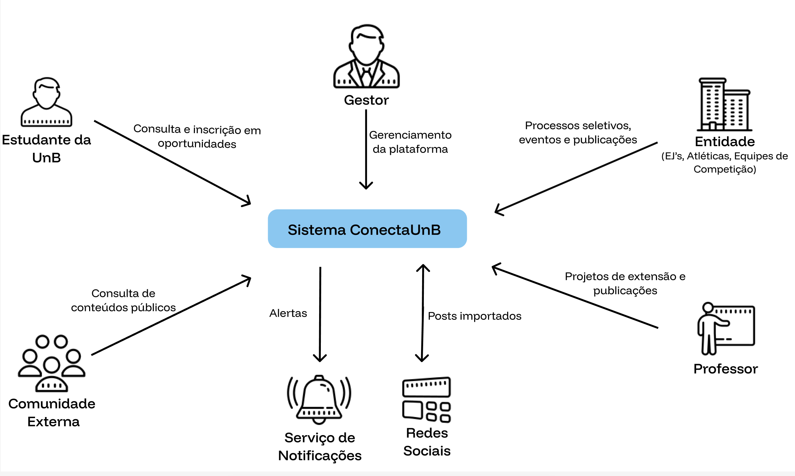

# Solução Proposta

## Objetivo Geral do Produto 

O objetivo geral do produto é facilitar o engajamento acadêmico através da centralização de informações de projetos de extensão, empresas juniores, equipes de competição dentre outras atividades extracurriculares. O produto atua como um hub de oportunidades, eliminando a busca por perfis nas redes sociais ou de murais espalhados pela faculdade, melhorando a eficácia da comunicação e garantindo que o aluno encontre tudo o que precisa para sua formação complementar em um único lugar além de proporcionar à comunidade externa informações sobre o que a universidade está produzindo. 

## Objetivos Específicos (OE) do Produto 

- **(OE1)** Fornecer um canal unificado e padronizado para a publicação de processos seletivos e ações das entidades; 
- **(OE2)** Democratizar e reduzir as barreiras de acesso e busca por meio de navegação pública;
- **(OE3)** Promover o portfólio de projetos e tecnologias da universidade para a sociedade civil e o mercado externo; 
- **(OE4)** Proporcionar ao titular do projeto métricas de engajamento; 
- **(OE5)** Preservar a memória institucional; 

## Características de Produto (mapeadas com os Objetivos Específicos do Produto) 

| 
OE principal
 | 
Contribuição secundária
  | Característica | 
Descrição resumida
 | 
Valor de negócio (VN) principal
 |
| :--- | :--- |  :--- | :--- | :--- |
| OE1   Fornecer um canal unificado e padronizado para a publicação de processos seletivos e ações das entidades; | OE5   Preservar a memória institucional;     OE3   Promover o portfólio de projetos e tecnologias da universidade para a sociedade civil e o mercado externo;  | CP1   Módulo de Perfis Institucionais | Espaço centralizado dedicado para que cada entidade crie, gerencie e exiba suas informações, processos seletivos e projetos. | VN1   Divulgação padronizada das entidades da instituição. |
| OE2   Democratizar e reduzir as barreiras de acesso e busca por meio de navegação pública; | OE3   Promover o portfólio de projetos e tecnologias da universidade para a sociedade civil e o mercado externo;     OE1   Fornecer um canal unificado e padronizado para a publicação de processos seletivos e ações das entidades; | CP2   Feed de visualização | Interface dinâmica para exibição contínua das postagens e oportunidades abertas pelas entidades acadêmicas.  | VN2   Melhoria no processo de exposição de projetos e ações das entidades. |
| OE4   Proporcionar ao titular do projeto métricas de engajamento; | OE1   Fornecer um canal unificado e padronizado para a publicação de processos seletivos e ações das entidades; | CP3   Métricas de Engajamento | Ferramenta de análise que consolida e apresenta os indicadores de interação e desempenho das publicações de uma entidade. | VN3   Entender melhor as maiores demandas e o engajamento dos projetos da instituição. |
| OE1   Fornecer um canal unificado e padronizado para a publicação de processos seletivos e ações das entidades; | OE3   Promover o portfólio de projetos e tecnologias da universidade para a sociedade civil e o mercado externo;     OE5   Preservar a memória institucional; | CP4   Publicações independentes |  Módulo que permite aos titulares das entidades a criação e edição autônoma de posts com textos e mídias. | VN4   Facilitação na disseminação de processos e ações das entidades. |
| OE2   Democratizar e reduzir as barreiras de acesso e busca por meio de navegação pública; | OE3   Promover o portfólio de projetos e tecnologias da universidade para a sociedade civil e o mercado externo; | CP5   Mecanismo de Busca e Filtragem | Ferramenta de pesquisa que permite localizar vagas, postagens e entidades utilizando parâmetros de categorização (ex: área de atuação, tipo de entidade). | VN5   Melhoria do processo interno de descoberta de projetos por parte dos alunos. |
| OE5   Preservar a memória institucional; | OE3   Promover o portfólio de projetos e tecnologias da universidade para a sociedade civil e o mercado externo;     OE2   Democratizar e reduzir as barreiras de acesso e busca por meio de navegação pública; | CP6   Repositório Histórico de Iniciativas | Acervo digital consultável que consolida e mantém disponíveis os registros de projetos, processos e entidades passadas. | VN6   Preservação e exposição do histórico do ecossistema da universidade. |
| OE3   Promover o portfólio de projetos e tecnologias da universidade para a sociedade civil e o mercado externo; | OE2   Democratizar e reduzir as barreiras de acesso e busca por meio de navegação pública; | CP7   Portal de Acesso Público | Modo de visualização aberta que disponibiliza o portfólio da plataforma para visitantes externos sem a exigência de autenticação prévia de maneira eficiente e de rápido acesso. | VN7   Ampliação da visibilidade institucional para a sociedade, mantendo a democratização do acesso interno. |
| OE2   Democratizar e reduzir as barreiras de acesso e busca por meio de navegação pública; | OE4   Proporcionar ao titular do projeto métricas de engajamento; | CP8   Notificação para os usuários | Facilitar o recebimento da informação por parte do usuário que pode ser notificado quando algum projeto de seu interesse tiver atualizações ou abertura de processos seletivos | VN5   Melhoria do processo interno de descoberta de projetos por parte dos alunos. |
| OE2   Democratizar e reduzir as barreiras de acesso e busca por meio de navegação pública; | OE1   Fornecer um canal unificado e padronizado para a publicação de processos seletivos e ações das entidades; | CP9   Privacidade e conformidade com LGPD | Incorporar mecanismos e decisões relacionadas a privacidade e a segurança baseando-se na LGPD | VN8   Redução de riscos relacionados à segurança |

## Diagrama de Contexto

Com base nos requisitos levantados, no mapa de stakeholders e no rich picture elaborados durante a etapa de elicitação, foi construído o diagrama de contexto do ConectaUnB, representado na Figura 1. O diagrama apresenta o sistema como uma caixa preta, evidenciando suas fronteiras de atuação e os principais atores e sistemas externos que interagem com a plataforma, bem como os fluxos de informação trocados entre eles.

  
<strong>Figura 3</strong> - Diagrama de Contexto do ConectaUnB

  

## Tecnologias a Serem Utilizadas 

Para a construção da solução proposta para o Conecta UnB, serão adotadas tecnologias modernas e compatíveis com a necessidade de centralização de informações, alta disponibilidade e desenvolvimento iterativo.  

- **Nest.js:** Será utilizado para a criação do backend, atuando como uma API escalável. O backend será o responsável por processar as regras de negócio, gerenciar a autenticação e intermediar de forma segura a comunicação entre o frontend e o banco de dados. 

- **PostgreSQL:** É um sistema de gerenciamento de banco de dados relacional. Foi escolhido para armazenar os dados estruturados do sistema. Sua robustez garantirá a integridade das complexas relações entre os usuários, entidades acadêmicas, e suas respectivas publicações. 

- **Prisma (ORM):** Ele atuará como a ponte de comunicação entre o NestJS e o PostgreSQL. Ele assegurará a tipagem estrita de dados, proteção contra injeções SQL e a gestão versionada das alterações estruturais do banco. 

- **Swagger:** Ferramenta que será acoplada ao backend para gerar uma documentação viva, automática e interativa das rotas da API, facilitando os testes e a integração clara entre as equipes de desenvolvimento do frontend e backend sendo útil para uma visualização do que foi desenvolvido no backend. 

- **Next.js:** Utilizaremos esse framework para o frontend, sendo um framework moderno e robusto, facilitando a criação de interfaces responsivas, renderização otimizada e boa indexação nos motores de busca, garantindo a acessibilidade pública da plataforma.

- **Tailwind CSS:** Framework CSS utilitário que será integrado ao frontend para que possamos acelerar a construção das interfaces. Ele permitirá a criação de um design responsivo, moderno e consistente de maneira ágil. 

- **Docker:** Será usado na conteinerização para empacotar as aplicações e suas dependências. Isso garantirá um ambiente de desenvolvimento padronizado, evitando conflitos e assegurando que o código funcione de forma consistente em qualquer máquina. 

- **Jest:** Framework de testes que será adotado para a criação e execução de testes automatizados. 

- **Figma:** É a plataforma de design colaborativa que vamos utilizar para a ideação, prototipagem das telas e validação da experiência do usuário antes da fase de implementação em código. 

- **GitHub:** Plataforma de hospedagem do código-fonte que centralizará o repositório do projeto.  

- **Cloudflare R2:** É um serviço de armazenamento de objetos (Object Storage) em nuvem focado em Edge Computing. Será utilizado para hospedar os arquivos de mídia (como fotos das publicações, logos das entidades, etc), caracterizando-se pela isenção de taxas de transferência de dados para a internet. 

- **Koyeb:** Será a plataforma onde o contêiner Docker do backend (NestJS) será hospedado. Garantirá a disponibilidade contínua da API de forma gratuita para a fase inicial de operação. 

- **Neon.tech:** Plataforma provedora de banco de dados PostgreSQL gerenciado na nuvem. Hospedará os dados da aplicação em produção, destacando-se por sua segurança e escalabilidade automática. 

- **Vercel:** Plataforma de nuvem otimizada para o ecossistema frontend, escolhida para hospedar a aplicação Next.js. Ela automatizará as entregas contínuas e garantirá tempos de resposta ultrarrápidos através de sua rede de distribuição global (Edge Network), além de prover certificados SSL nativos. 

- **Turborepo:** Orquestrador para arquiteturas monorepo, ele irá gerenciar a convivência do Next.js e NestJS no mesmo repositório, otimizando os fluxos de integração que reduzirão o tempo de compilação. 

- **GitHub Actions:** Serviço de automação integrado ao repositório, utilizado para implementar as esteiras de Integração e Entrega Contínuas (CI/CD). Ele será responsável por acionar testes automatizados a cada atualização de código e orquestrar o deploy para a Vercel e para a Koyeb de forma automática. 

- **JWT (JSON Web Token):** Será utilizado para emitir tokens de acesso seguros. Isso garantirá que apenas usuários autenticados e autorizados possam realizar ações como publicações e edições. 

Além das ferramentas de desenvolvimento, também serão considerados mecanismos de segurança, privacidade e estrita conformidade com a LGPD (Lei Geral de Proteção de Dados Pessoais), em alinhamento com as características do produto e garantindo a proteção das informações dos alunos e da comunidade acadêmica. 

## PESQUISA DE MERCADO E ANÁLISE COMPETITIVA  

Algumas soluções são atualmente empregadas para a divulgação no contexto da Universidade de Brasília, entre as mais utilizadas pelos alunos estão os grupos da faculdade no WhatsApp, que servem para comunicação entre os discentes e para a publicação das oportunidades disponíveis. Contudo, por se tratar de um aplicativo de mensagem, os avisos e publicações são rapidamente perdidos quando novas mensagens são enviadas, além da fragmentação da informação, uma vez que grupos específicos recebem publicações específicas, fazendo com que alunos estejam em múltiplos grupos para se manterem informados. 

Outra solução já empregada é o site do decanato de extensão, atuando como um canal mais formal de propagação de oportunidades. O site disponibiliza atividades de extensão, como PIBEX e ações da semana universitária, entretanto o site deixa de fora oportunidades de empresas juniores e seleção de projetos.  

Além de que a informação fica fragmentada entre os diversos sites da UnB, temos o exemplo do projeto Imagine do professor Ricardo Fragelli, que pode ser encontrado no site UnB Notícias, mas não no Decanato de extensão. 

O SIGAA também possibilita o acesso a informações de atividades de extensão, mas também se limita a atividades ofertadas pelos professores, não abarcando atléticas, empresas juniores e equipes de competição. Ademais, o sistema é pouco intuitivo com a interface “ultrapassada”, não permitindo uma visualização de vídeos e imagens que demonstrem o que é desenvolvido nas atividades extensionistas. 

Há também as plataformas externas como o Instagram, que são meios de comunicação amplamente utilizados pelas entidades estudantis para divulgação de processos seletivos, projetos e eventos. O maior problema que aflige essas plataformas é a dependência do algoritmo de recomendação, onde as informações postadas não alcançam o público de maneira linear, divulgando apenas para usuários que já estão inseridos no meio. Esse fator gera uma bolha que impede que a comunidade conheça tais projetos, tornando o trabalho de divulgação mais manual e orgânico. 

Diante desse cenário, evidencia-se uma carência de uma plataforma unificada, pois o ecossistema atual força os discentes e docentes a buscas e pesquisas manuais exaustivas. Vale ressaltar que a principal dificuldade diante das outras plataformas é o processo de adesão da comunidade diante de plataformas mais consolidadas, pois, apesar dos inúmeros problemas elencados, o usuário tende a utilizar os meios já conhecidos de divulgação, mesmo que sejam mais trabalhosos. 

## Viabilidade da Proposta 

A proposta é viável no contexto da disciplina, considerando o acesso ao cliente, o escopo definido e a possibilidade de entrega incremental de um MVP até o encerramento do semestre, previsto para 7 de julho de 2026. A equipe é composta por seis integrantes com habilidades variadas, sendo que parte deles possui experiência consolidada na Stack  adotada, o que proporciona uma base técnica suficiente para sustentar o desenvolvimento. O contato estabelecido com representantes de empresas juniores, atléticas, equipes de competição, professores e alunos viabiliza validações frequentes e garante aderência às necessidades reais dos usuários ao longo do projeto. 

A Stack tecnológica escolhida é amplamente difundida, bem documentada e compatível com o escopo do MVP. Aspectos de segurança, privacidade e conformidade com a LGPD também serão considerados desde o início do desenvolvimento, em alinhamento com as características do produto. 

Os principais riscos identificados estão na adesão dos representantes institucionais à plataforma, integração e padronização de informações provenientes de diferentes setores da universidade, na conciliação de agendas entre equipe e stakeholders, na gestão de diferentes expectativas dos grupos envolvidos e na pressão de prazo combinada com outras demandas acadêmicas dos integrantes. Cada um desses riscos conta com uma estratégia de mitigação específica:  

- A adesão dos representantes será incentivada pelo contato já estabelecido com empresas juniores e projetos da FCTE. 
- A padronização dos dados será endereçada por meio de um modelo de dados estruturado e de um fluxo de cadastro uniforme na plataforma. 
- A gestão de agendas será facilitada pela colaboração assíncrona via Git e GitHub. 
- A divergência de expectativas será tratada por meio de priorização e mediação contínua das demandas. 
- A pressão de prazo será contornada pela priorização das funcionalidades essenciais, garantindo uma entrega viável e de valor dentro do prazo da disciplina.  

Assim, a proposta é considerada viável, desde que: 

- O escopo do MVP permaneça controlado; 
- As prioridades sejam mantidas ao longo das entregas; 
- A equipe mantenha uma divisão de tarefas clara e equilibrada;  
- O alinhamento com os stakeholders ocorra de forma regular e estruturada. 

## Benefícios Esperados 

A implementação da Conecta UnB visa otimizar a comunicação institucional e o engajamento da comunidade acadêmica. Os principais benefícios dividem-se entre os gestores das atividades e o público geral: 

Para as entidades e organizações estudantis: 

- Centralização e padronização das divulgações em um canal oficial; 
- Aumento de alcance na captação de novos membros e bolsistas; 
- Otimização operacional com marketing;
- Fortalecimento da memória institucional. 
 
Para os usuários e comunidade acadêmica:

- **Experiência de descoberta:** acesso simplificado e ágil às informações por meio de uma navegação fluída no catálogo de projetos; 
- **Transparência:** facilidade no acompanhamento de editais e períodos de inscrição em processos seletivos; 
- **Visibilidade de impacto:** visão clara do impacto social e das tecnologias desenvolvidas dentro do ambiente universitário. 